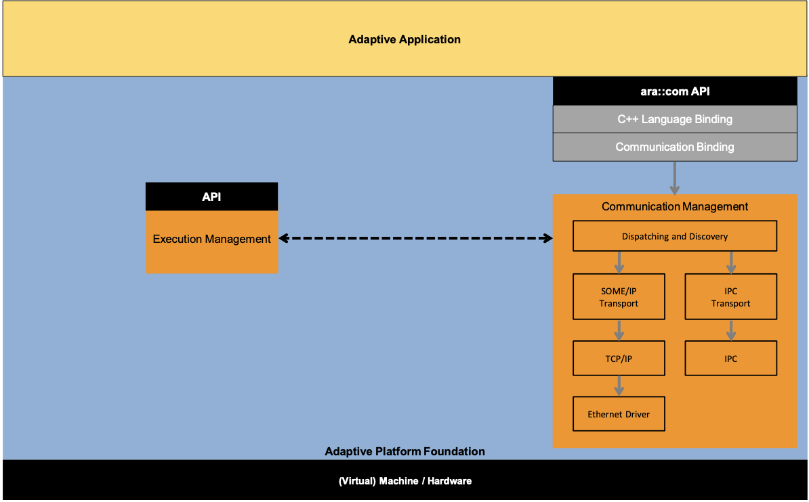
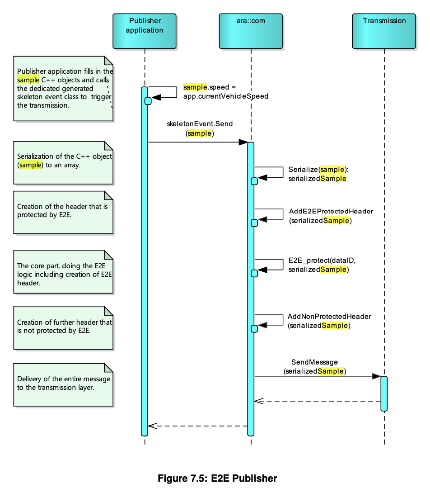
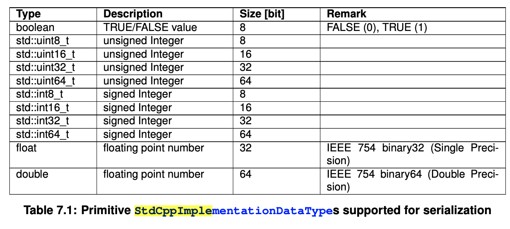
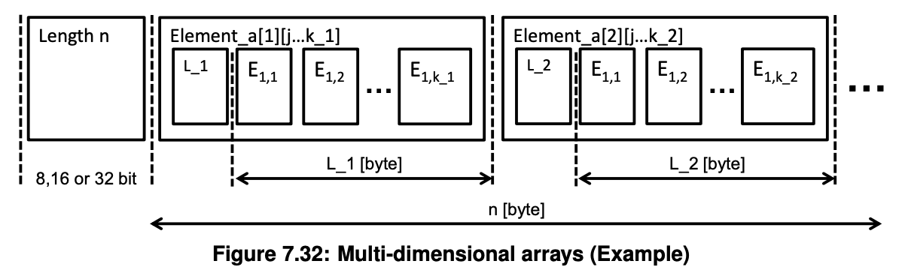
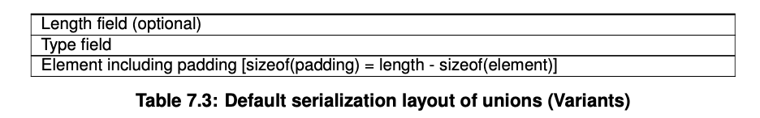
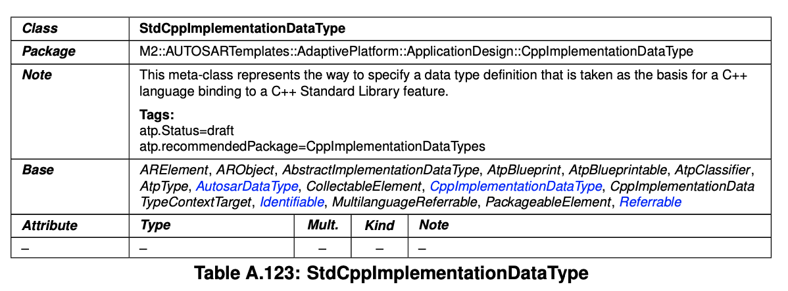

## 2 Acronyms and Abbreviations
* Callable:
C ++のコンテキストでは、Callableは次のように定義されます。Callableタイプは、INVOKE操作（std :: function、std :: bind、std :: thread :: threadなどで使用される）が適用可能なタイプです。この操作は、ライブラリ関数std::invokeを使用して明示的に実行できます。 （C ++ 17以降）  
* serializedSample:  
serializedSampleは、C ++オブジェクトの配列へのシリアル化であり、e2e保護の一部であるヘッダーとシリアル化されたデータで構成されます。  


## 7 Functional specification
### 7.1 General description
AUTOSARAdaptiveアーキテクチャは、AUTOSARAdaptive FoundationのソフトウェアをFunctional clusterとして編成します。これらのクラスターは、アプリケーションへのサービスとして共通の機能を提供します。 AUTOSARAdaptiveのCommunicationManagement（CM）は、このようなFunctional Clusterであり、「AUTOSAR RuntimeforAdaptiveApplications」-ARAの一部です。ローカルとリモートの両方のアプリケーション間の通信パスの構築と監視を担当します。  
CMは、1台のマシン内のAdaptive AUTOSARアプリケーション間、および他のマシン上のソフトウェアエンティティとの通信を可能にするインフラストラクチャを提供します。その他のAdaptiveAUTOSARアプリケーションまたはClassicAUTOSARSWC。すべての通信パスは、設計時、起動時、または実行時に確立できます。  
この仕様には、APIの構文、APIとモデルの関係が含まれ、セマンティクスが記述されています。ステートマシンを介して、事前条件、事後条件、およびAPIの使用を想定します。この仕様では、プラットフォーム実装のSWアーキテクチャに制約がないため、基本的なソフトウェアモジュールの定義や、CommunicationManagementの実装または内部技術アーキテクチャの仕様はありません。  


#### 7.1.1 Architectual concepts
AUTOSAR AdaptiveのComunication Managementは、論理的に次のサブパートに分けることができます。:  
* Language binding
* End-to-end communication protection
* Communication / Network binding
* Communication Management software



Communication Managementのコンテキストでは、次のタイプのインターフェースが定義されています。:  
* Public Application Interface：Adaptive AUTOSAR APIの一部であり、SWSで指定されています。これは標準化されたara::comAPIです。
* Functional Clusterの相互作用：Functional Cluster間の相互作用。規範的ではなく、仕様を読みやすくし、SWのデモンストレーターへの統合をサポートすることを目的としています。 （7.1の点線の矢印）また、Functional Cluster内の要素間の相互作用。仕様では使用されていないため、標準化されていないインターフェイスです。CMソフトウェア内の通信に使用されます（7.1の灰色の矢印）  

言語バインディングと通信バインディングはインテグレーターによる特定の構成に依存しますが、アプリケーションバイナリ内にデプロイする必要があることに注意してください。これにより、Communication Bindingのシリアル化は、AdaptiveApplicationの実行コンテキストで実行されます。  
ARA APIの設計には、次の制約が適用されます。  
* アプリケーションソフトウェアコンポーネントの独立性をサポートする
* 特定の通信プロトコルに依存せずにサービス指向の通信を使用する
* APIを可能な限りスリムにし、APIの上で実行できる非常に具体的なユースケースをサポートしたり、コンポーネントモデルやより高いレベルの概念をサポートしたりしないでください。 APIは、コア通信メカニズムをサポートするように制限されています。
* Support for dynamic communication:
 * アプリケーションミドルウェアによる検出はありません。クライアントはサーバーを認識していますが、サーバーはクライアントを認識していません。イベントサブスクリプションは、アプリケーションの唯一の動的通信パターンです。
 * アプリケーションでのフルサービスディスカバリ。構成時に通信パスは不明です。サービス検出用のAPIを使用すると、アプリケーションコードでサービスインスタンスを選択できます。
* APIのイベント/コールバックとポーリングスタイルの両方の使用をサポートして、従来のRTEスタイルのパラダイムを有効にします。コールバックベース/イベントベースのインタラクションの場合に高い決定論の要求をサポートするために、制御されていないコンテキストスイッチを回避する可能性があります。
* 同期コールバックベースの通信と非同期通信の哲学の両方をサポートします。
* クライアント/サーバー通信のサポート。
* キューに入れられたセマンティクスによる送信者/受信者の通信のサポート受信者のキャッシュは構成可能です。
* タスクアクティベーションのトリガー条件の選択のサポート。
* Extensions for security.
* Extensions for Quality Of Service QoS.
* Scalability for real-time systems.
* 組み込みのエンドツーエンド通信保護のサポート。ARAAPI上でユースケース固有の動作を実行できます。

#### 7.1.2 Design decisions
The design of the ARA API covers the following principles:  
* It uses the Proxy/Skeleton pattern:  
 * （サービス）プロキシは、おそらくリモート（つまり、他のプロセス、他のコア、他のノード）サービスの代表です。これは、サービスを使用するアプリケーション/クライアントにローカルなC++クラスのインスタンスです。
 * （サービス）スケルトンは、ユーザーが提供するサービス実装をミドルウェアトランスポートインフラストラクチャに接続することです。サービス実装クラスは、（サービス）スケルトンから派生します。
 * プロキシ/スケルトンのほかに、プロキシとスケルトンを管理するためのいくつかの基本事項を提供する、いわゆる「ランタイム」（シングルトン）クラスが存在する場合があります。ただし、これはCMソフトウェアの実装に固有であるため、このドキュメントでは指定されていませんが、将来のバージョンで指定される可能性があります。

Regarding proxy/skeleton design pattern in general and its role in middleware implementations, see [9] [10].  
* It supports callback mechanisms on data reception.
* he API has zero-copy capabilities including the possibility for memory manage-
ment in the middleware.
* AUTOSARサービスモデル（サービス、インスタンス、イベント、メソッドなど）と連携して、このモデルからプロキシとスケルトンを生成できるようにします。
* APIレベルでの完全な検出とサービスインスタンスの選択のサポート。
* クライアント/サーバー通信は、C++11言語によって導入された概念を使用します。
std :: future、std :: promise、異なるコンテキスト間のメソッド呼び出しを完全にサポートします。
* SOME / IP固有の動作から抽象化しますが、メソッド、イベント、およびフィールドとしてSOME/IPサービスメカニズムをサポートします。
* [7]および[4]で指定されているように、標準のエンドツーエンド保護プロトコルをサポート/実装します。
* Support of Service contract versioning.
* APIのイベントとポーリングスタイルの使用を等しくサポートして、従来のRTスタイルのパラダイムを有効にします。
* API設計のC++11/14機能を十分に活用して、アプリケーション開発者に使いやすさと快適さを提供します。

ARA API設計の詳細と説明については、ARAComAPIの説明[1]を参照してください。

#### 7.2.2 Publisher
[SWS_CM_90453]{DRAFT}  
「  
E2Eで保護されたイベントの場合、E2E保護はSendのコンテキスト内で実行されるものとします。
」  
Figure 7.5 shows an overview of the interaction of components involved during the E2E
protection at the publisher side.  



##### 7.8.1.3 Executioin context of message reception actions
次のセクションでは、「受信時」という用語は、特定のアクション（[SWS_CM_10294]に従ったペイロードの逆シリアル化など）がメッセージの実際の受信とそれぞれのEventクラスの対応するAPI（たとえば、GetNewSamples（[SWS_CM_00701]を参照）メソッド）の呼び出し。この仕様は、これらのアクションがメッセージ受信のコンテキストで実行されるのか、API呼び出しのコンテキストで実行されるのか、または完全に別個の実行コンテキストで実行されるのかを意図的に明示しておらず、具体的なara::com実装の潜在的な最適化の余地を残しています。　　
ここで課せられる唯一の制限は、EventReceiveHandlerの実行コンテキストに関するものです（[SWS_CM_00309]を参照）。 – GetNewSamples（[SWS_CM_00701]を参照）メソッドのコンテキストでEventReceiveHandlerを実行することは許可されていません。これは、[SWS_CM_00181]に従って、EventReceiveHandlersがGet-NewSamplesメソッドを使用して取得したイベントデータにアクセスするためです。  
[SWS_CM_11270]{DRAFT} Selecting elements of the ServiceInterface for SecOC transmission  
「
特定のAdaptivePlatformServiceInstanceのServiceInterfaceのどの要素をSecOCによって保護するかを定義することができます。  
ServiceInterface要素の選択は、AdaptivePlatformServiceInstanceによって集約されるServiceInterfaceElementSecureComConfigによって行われます。  
ServiceInterfaceElementSecureComConfigの次の構成が適用可能です。:  
* Methods  
ロールmethodCallおよびmethodReturnは、ServiceInterfaceElementSecureComConfig要素で使用可能な構成設定を使用してSecOCによって保護されるメソッドを識別します。  
* Events  
ロールイベントは、ServiceInterfaceElementSecureComConfig要素で使用可能な構成設定を使用してSecOCによって保護されるイベントを識別します。  
* Fields  
ロールfieldNotifier、getterCall、getterReturn、setterCall、およびsetterReturnは、ServiceInterfaceElementSecureComConfig要素で使用可能な構成設定を使用してSecOCによって保護されるフィールドコンテンツを識別します。
」
##### 7.8.1.4 Handling Events
[SWS_CM_10287] Conditions for sending of a SOME/IP event message  
「
少なくとも1人のアクティブな加入者がいて、イベントを含むサービスの提供に停止されていない（SOME / IP OfferServiceメッセージ（[SWS_CM_00203]を参照）に含まれるTTLが期限切れになったか、ServiceSkeletonクラスのStopOfferServiceメソッド（[SWS_CM_00111]を参照）が呼び出されたため）。アクティブなサブスクライバーは、それぞれのイベントクラスのSubscribeメソッド（[SWS_CM_00141]を参照）を呼び出し、それぞれのEventクラスのUnsubscribeメソッド（[SWS_CM_00151]を参照）を呼び出してサブスクリプションをキャンセルしていないAdaptive Applicationです。 SOME / IPSubscribeEventgroupメッセージ（[SWS_CM_00205]を参照）に含まれるTTLを超えたため、サブスクリプションはまだ有効期限が切れていません。
」  
[SWS_CM_10288] Transport protocol for sending of a SOME/IP event message  
「
マニフェストのロールevent-GroupのProvidedSomeipServiceInstanceによって集約されたSomeipProvidedEventGroupのmulticastThreshold属性によって定義されたしきい値に達した場合、SOME / IPイベントメッセージはUDPを使用して送信されます（[PRS_SOMEIPSD_00134]を参照）。  
SOME / IPイベントメッセージは、このしきい値に達していない場合、マニフェストの属性SomeipServiceInterfaceDeployment.eventDeployment.transportProtocolで定義されたトランスポートプロトコルを使用して送信されます（[PRS_-SOMEIPSD_00802]を参照）。
」  
[SWS_CM_10289] Source of a SOME/IP event message  
「
SOME / IPイベントメッセージは、SOME / IP OfferServiceメッセージ（[SWS_CM_00203]）のIPv4 / v6エンドポイントオプション（[PRS_SOMEIPSD_00304]を参照）から取得したユニキャストIPアドレスとポートを、トランスミッション。
」  
[SWS_CM_10290] Destination of a SOME/IP event message  
「
SOME / IPイベントメッセージは、SOME / IPSubscribeEventgroupAckメッセージ（[SWS_CM_00206]を参照）のIPv4 / v6マルチキャストオプション（[PRS_SOMEIPSD_00322]を参照）から取得したマルチキャストIPアドレスとポートを宛先アドレスと宛先ポートとして使用するものとします。マニフェストのロールeventGroupのProvidedSomeipServiceInstanceによって集約されたSomeipProvidedEventGroupのmulticastThreshold属性によって定義されたしきい値に達した場合の送信（[PRS_-SOMEIPSD_00134]を参照）。 SOME / IPイベントメッセージは、送信の宛先アドレスと宛先ポートとして、SOME / IPSubscribeEventgroupメッセージ（[SWS_CM_00205]）のIPv4 / v6エンドポイントオプション（[PRS_SOMEIPSD_00304]を参照）から取得したユニキャストIPアドレスとポートを使用するものとします。このしきい値に達していない場合（[PRS_SOMEIPSD_00134]を参照）。 SOME / IPSubscribeEventgroupメッセージに複数のエンドポイントオプションが含まれている場合は、選択したトランスポートプロトコル（[SWS_CM_10289]を参照）に一致するものを使用する必要があります。
」  

[SWS_CM_10291] Content of the SOME/IP event message  
「
SOME/IPイベントメッセージのエントリは次のとおりです。：  
* サービスID（[PRS_SOMEIP_00040]を参照）は、SomeipServiceInterfaceDeployment要素がserviceInterfaceIdを定義するマニフェストから取得されます。
* イベントID（[PRS_SOMEIP_00040]を参照）は、SomeipServiceInterfaceDeployment要素がeventDeployment.eventIdを定義するマニフェストから取得されます。
* 長さ（[PRS_SOMEIP_00042]を参照）は、8ずつインクリメントされたバイト単位のシリアル化されたペイロードの長さに設定されます（長さでカバーされるSOME / IPヘッダーの2番目の部分）。
* クライアントID（[PRS_SOMEIP_00702]を参照）はイベントメッセージ（[PRS_SOMEIP_00702]による）には使用されないため、0x0000に設定する必要があります。
* 非アクティブなセッション処理の場合は、[SWS_CM_10240]を参照してください。セッションID（[PRS_SOMEIP_00703]を参照）はイベントメッセージに使用されないため、0x0000（[PRS_SOMEIP_00932]を参照）および[PRS_SOMEIP_00925]に設定されます。  

アクティブなセッション処理の場合（[SWS_CM_10240]を参照）、セッションIDはイベントメッセージに使用されるため、イベントメッセージが送信されるたびに（適切なラップアラウンドで）インクリメントされます（[PRS_SOMEIP_- 00933]、[PRS_SOMEIP_00934]を参照]。 [PRS_SOMEIP_00521]、および[PRS_SOMEIP_- 00925]）。  
イベントに対してセッション処理がアクティブ化されているか非アクティブ化されているかに関する情報は、イベントを指すTransformation-PropsToServiceInterfaceElementMappingによって参照されるAp-SomeipTransformationPropsに含まれるsessionHandling属性から取得できます。  
* プロトコルバージョン（[PRS_SOMEIP_00052]を参照）は0x01に設定する必要があります。
* インターフェイスバージョン（[PRS_SOMEIP_00053]を参照）は、SomeipServiceInterfaceDeployment要素がserviceInterfaceVersion.majorVersionを定義するマニフェストから派生する必要があります。
* メッセージタイプ（[PRS_SOMEIP_00055]を参照）は、NOTIFICATION（0x02）に設定する必要があります。
* リターンコード（[PRS_SOMEIP_00058]および[PRS_SOMEIP_00191]を参照）はイベントメッセージに使用されないため、（[PRS_SOMEIP_00925]による）E_OK（0x00）に設定する必要があります。
* ペイロードには、SOME / IPシリアル化ルールに従ってシリアル化されたペイロード（つまり、ロールイベントでServiceInterfaceによって構成されるシリアル化されたVariable-DataPrototype）が含まれている必要があります。
」

##### 7.8.1.7 Handling Fields
[SWS_CM_10319] Conditions for sending of a SOME/IP event message  
「  
SOME / IPイベントメッセージの送信は、それぞれのフィールドクラスのUpdateメソッドを呼び出すことによって（[SWS_CM_00119]を参照）、またはRegisterSetHandlerに登録されたSetHandlerによって返されるFuture（[SWS_CM_00116]を参照）が少なくとも1つのアクティブなサブスクライバーがあり、イベントを含むサービスの提供が停止されていない場合（SOME / IP OfferServiceメッセージ（[SWS_CM_00203]を参照）に含まれるTTLが期限切れになっているため、またはStopOfferServiceメソッド（を参照） ServiceSkeletonクラスの[SWS_CM_00111]）が呼び出されました）。アクティブなサブスクライバーは、それぞれのFieldクラスのSubscribeメソッド（[SWS_CM_00120]を参照）を呼び出し、それぞれのFieldクラスのUnsubscribeメソッド（[SWS_CM_00120]を参照）を呼び出してサブスクリプションをキャンセルしていないAdaptive Applicationです。また、SOME / IP SubscribeEventgroupメッセージ（[SWS_CM_00205]を参照）に含まれるTTLを超えてから、サブスクリプションの有効期限がまだ切れていない場合。  
」 
[SWS_CM_10320] Transport protocol for sending of a SOME/IP event message  
「
マニフェストのロールeventGroupのProvidedSomeipServiceInstanceによって集約されるSomeipProvidedEventGroupのmulticastThreshold属性によって定義されたしきい値に達した場合、SOME / IPイベントメッセージはUDPを使用して送信されます（[PRS_SOMEIPSD_00134]を参照）。 SOME / IPイベントメッセージは、属性SomeipServiceInterfaceDeployment.fieldDeployment.notifierで定義されたトランスポートプロトコルを使用して送信されます。このしきい値に達していない場合は、マニフェストのtransportProtocol（[PRS_SOMEIPSD_00802]を参照）。
」

> プロトコルはUDPで良さそう。  

[SWS_CM_10321] Source of a SOME/IP event message ⌈  
SOME / IPイベントメッセージの送信元アドレスと送信元ポートは、[SWS_CM_10289]に従って設定する必要があります。
」  

##### 7.8.1.8 Structured Data Types(structs)
[SWS_CM_00252] Missing size of length field for structs  
「  
属性SomeipDataPrototypeTransformationProps.someipTransformationProps.sizeOf-StructLengthFieldが0に等しい値に設定されている場合、ApSomeipTransformationPropsがSomeipDataPrototypeTransformationProps.someipTransformationPropsを介して定義されているシリアル化された構造体の前に長さフィールドを挿入しないでください。
」  
[SWS_CM_00253] Default size of length field for structs  
「  
TransformationPropsToServiceInterfaceElementMapping.transformationProps.sizeOfStructLengthFieldが0に等しい値に設定され、属性Someip- DataPrototypeTransformationProps.someipTransformationProps.sizeOfStructLengthFieldが設定されていない場合、ApSomeipTransformationPropsがSomeipDataProsを介して定義されるシリアル化された構造体の前に長さフィールドを挿入しないでください。
」    
[SWS_CM_00254] Precedence when setting size of length field for structs 
「  
If attribute TransformationPropsToServiceInterfaceElementMapping.trans- formationProps.sizeOfStructLengthField is set to a value greater 0 and attribute SomeipDataPrototypeTransformationProps.someipTransfor- mationProps.sizeOfStructLengthField is not set, a length field shall be inserted in front of the serialized struct for which the ApSomeipTransformation- Props is defined via SomeipDataPrototypeTransformationProps.someip- TransformationProps.
」  

[SWS_CM_00255] Default size of length field for structs  
「  
If attribute Trans- formationPropsToServiceInterfaceElementMapping.transformation- Props.sizeOfStructLengthField is not set and attribute SomeipDataPro- totypeTransformationProps.someipTransformationProps.sizeOf- StructLengthField is not set, no length field shall be inserted in front of the serialized struct.
」  

[SWS_CM_00256] Default data type for the length field of structs  
「  
If TransformationPropsToServiceInterfaceElementMapping.transformationProps. sizeOfStructLengthField defines the the data type for the length field of a struct, the data shall be:  
* uint8 if sizeOfStructLengthField equals 1
* uint16 if sizeOfStructLengthField equals 2
* uint32 if sizeOfStructLengthField equals 4
」  

[SWS_CM_00257] Missing size of array length field  
「  
If attribute SomeipDataPrototypeTransformationProps.someipTransformationProps.sizeO- fArrayLengthField is set to a value equal to 0, no length field shall be inserted in front of the serialized array for which the ApSomeipTransformationProps is defined via SomeipDataPrototypeTransformationProps.someipTransfor- mationProps. – Note that omitting the length field by setting someipTransforma- tionProps.sizeOfArrayLengthField to 0 is only allowed for arrays with static length (i.e., fixed length arrays) though (see also [constr_3447]).⌋
」  
[SWS_CM_00258] Default size of the length field for arrays  
「  
If attribute TransformationPropsToServiceInterfaceElementMapping.transforma- tionProps.sizeOfArrayLengthField is set to a value equal to 0 and attribute SomeipDataPrototypeTransformationProps.someipTransformation- Props.sizeOfArrayLengthField is not set, no length field shall be inserted in front of the serialized array for which the ApSomeipTransformationProps is defined via SomeipDataPrototypeTransformationProps.someipTransfor- mationProps. – Note that omitting the length field by setting someipTransforma- tionProps.sizeOfArrayLengthField to 0 is only allowed for arrays with static length (i.e., fixed length arrays) though (see also [constr_3447]).
」  

[SWS_CM_00259] Setting size of the length field for arrays  
「  
If attribute TransformationPropsToServiceInterfaceElementMapping.transforma- tionProps.sizeOfArrayLengthField is set to a value greater 0 and attribute SomeipDataPrototypeTransformationProps.someipTransformation- Props.sizeOfArrayLengthField is not set, a length field shall be inserted in front of the serialized array for which the ApSomeipTransformationProps is defined via SomeipDataPrototypeTransformationProps.someipTransformation- Props.
」  
[SWS_CM_00260] Datatype for the length field of arrays  
「
If Transforma- tionPropsToServiceInterfaceElementMapping.transformationProps. sizeOfArrayLengthField defines the the data type for the length field of a array, the data shall be:
* uint8 if sizeOfArrayLengthField equals 1 
* uint16 if sizeOfArrayLengthField equals 2 
* uint32 if sizeOfArrayLengthField equals 4
」  

[SWS_CM_10037] Alignment calculation  
「  
アライメントは常にSOME/IPメッセージの先頭から計算されます。
」  

この属性は、メモリアライメントを定義します。 SOME / IPネットワークバインディングは、パラメータを自動的に整列させようとはしませんが、指定されたとおりに整列します。現在、コードジェネレーターを簡素化するために、アライメントは1バイトの倍数に制限されています。  
SOME / IPペイロードが適切に整列されるように、SOME/IPペイロードをメモリに配置する必要があります。インフォテインメントECUの場合、8バイト（つまり64ビット）のアラインメントを達成する必要があります。すべてのECUの場合、少なくとも4バイトのアラインメントを達成する必要があります。効率的な調整は、ハードウェアに大きく依存します。  
[SWS_CM_10016] Deserializing of exceeded unexpected data   
「  
予想よりも多くのデータが逆シリアル化される場合、予期しないデータは破棄されます。既知の分数を考慮する必要があります。
」  

##### 7.8.1.8.1 Basic Data Types
[SWS_CM_10036] Serialization of supported StdCppImplementationDataTypes  
「  
シリアル化でサポートされる[13]で定義されているプリミティブStdCppImplementationDataTypesを表7.1に示します。  
  
」  
バイトオーダーは、ApSomeipTransformationPropsのbyteOrderによってすべてのパラメーターに共通に指定されます。  

##### 7.8.1.8.4 Structured Data Types (struct)
[SWS_CM_10042]SerializingastructDataType  
「  
Structure Cpp Implementation Data Typeは、深さ優先探索の順序でシリアル化する必要があります。
」  
SOME / IPネットワークバインディングは、構造体のパラメータを自動的に調整しません。
SOME / IPネットワークバインディングはそのようなパディングを自動的に追加しないため、アライメントに必要な場合は、予約済み/パディング要素をAUTOSARデータ型に挿入します。
したがって、たとえば構造体にstd::uint8_tとstd::uint32_tが含まれている場合、それらはバッファに順番に書き込まれます。これは、uint8とstd::uint32_tの最初のバイトの間にパディングがないことを意味します。したがって、std::uint32_tが整列されていない可能性があります。したがって、システム設計者は、必要な配置を実現するため、またはグローバルに設定するために、データ型にパディング要素を追加することを検討する必要があります。
整列されていない構造体などに関する警告は、SOME / IPネットワークバインディングでは行われず、SOME/IPネットワークバインディングの生成に使用されるツールチェーンでのみ行われるものとします。
SOME / IPネットワークバインディングは、ダミー/パディング要素を自動的に挿入しません。
SOME / IPでは、構造体の前に8、16、または32ビットの長さフィールドを追加できます。構造体の長さフィールドは、構造体のバイト数を表します。これにより、インターフェイスの移行を改善する拡張可能な構造体が可能になります。

##### 7.8.1.8.6 Strings
[SWS_CM_10053] Strings encoding
「  
Strings shall be encoded using Unicode and terminated with a "\0"-character.
」  
[SWS_CM_10054] Supported encoding
「  
UTF-8、UTF-16BE、UTF-16LEなどのさまざまなUnicodeエンコーディングがサポートされます。これらのエンコーディングの動的な長さは1文字あたりのバイト数であるため、バイト単位の最大長は、UTF-8の文字の長さの最大3倍に、「\0」またはUTF-16の文字と「\0」の2バイト。 UTF-8文字は最大6バイト、UTF-16文字は最大4バイトです。
」  

[SWS_CM_10055] UTF-16LE and UTF-16BE terminating bytes
「  
UTF-16LEおよびUTF-16BE文字列は、「\0」文字でゼロで終了する必要があります。これは、（少なくとも）2つの0x00バイトで終了することを意味します。
」  
[SWS_CM_10056] UTF-16LE and UTF-16BE strings length  
「  
UTF-16LE and UTF- 16BE strings shall have an even length.
」  

[SWS_CM_10057] Odd UTF-16LE and UTF-16BE string length  
「  
奇数の長さのUTF-16LEおよびUTF-16BE文字列の場合、最後のバイトは、受信するSOME/IPネットワークバインディングによってサイレントに削除されます。
」  

[SWS_CM_10058] String start byte(BOM)
「  
All strings shall always start with a Byte Order Mark (BOM).
」  

[SWS_CM_10059] BOM checking by SOME/IP network binding implementation  
「  
受信側のSOME/IPネットワークバインディング実装は、BOMをチェックし、完全なペイロードを破棄してインシデントをログに記録することにより、欠落しているBOMまたは不正な形式のBOMをエラーとして処理します（ara :: com実装でログが有効になっている場合）。
」  
[SWS_CM_10060] BOM addition 
「  
The BOM shall be added by the SOME/IP sending network binding implementation.
」  

[SWS_CM_10070] Serializing one-dimentional array  
「  
一次元配列は、配列要素を順番に連結することによってシリアル化されます。
」  
[SWS_CM_10072] Serializing multi-dimentional array  
「  
The serialization of multidimensional arrays shall happen in depth-first order.
」  

In case of multi-dimensional dynamic length arrays, each array (serialized as SOME/IP array) needs to have its own length field. See L_1 and L_2 in Figure 7.32.  

##### 7.8.1.8.7 Vectors and arrays
SOME / IPは静的および動的な長さの配列をサポートしますが、この抽象化レベルでのベクトルの定義はありません。したがって、ベクトルは動的な長さの配列にマップされます。 SOME / IP仕様では、動的長さのデータ構造の前に8、16、または32ビットの長さフィールドを追加する必要があります。配列の長さフィールドは、合計バイト数を表します。このセクションでは、ベクトルの実現にも使用できる配列という用語のみを使用していることに注意してください。  
[SWS_CM_10076] Serializing arrays  
「  
配列は、次の要素の連結としてシリアル化されます。:  
* 次の配列の長さ（バイト単位）を保持する長さインジケーター
* 配列のシリアル化された要素を含む配列
ここで、長さフィールドのサイズは、配列に適用されるApSomeipTransformationProps.sizeOfArrayLengthFieldで指定されたとおりに決定されます。
」  

##### 7.8.1.8.8 Associative Maps
連想マップは、マニフェストのカテゴリASSOCIATIVE_MAPを持つStdCppImplementationDataTypeとしてモデル化されます。 AUTOSARマニフェスト仕様[6]で述べられているように、連想マップのC++での「自然な」言語バインディングはara:: core：-：Map <key_type、value_type>です。ここでkey_typeは、 map要素とvalue_typeは、マップ要素の値のデータ型です。これにより、key_typeとvalue_typeは、連想マップCpp実装データ型によって集約された定義済みのCppTemplate引数から派生します。詳細については、[SWS_LBAP_00023]を参照してください。  
[SWS_CM_00264] Setting the size of the length field for associative maps  
「  
If at- tribute TransformationPropsToServiceInterfaceElementMapping.trans- formationProps.sizeOfArrayLengthField is set to a value greater 0 and attribute SomeipDataPrototypeTransformationProps.someipTransfor- mationProps.sizeOfArrayLengthField is not set, a length field shall be in- serted in front of the serialized associative map for which the ApSomeipTrans- formationProps is defined via SomeipDataPrototypeTransformationProps. someipTransformationProps. – Note that omitting the length field by setting someipTransformationProps.sizeOfArrayLengthField to 0 is only allowed for arrays with static length (i.e., fixed length arrays) though (see also [constr_3447]).
」  
[SWS_CM_00265] Datatype for the length field of associative maps ⌈If Trans- formationPropsToServiceInterfaceElementMapping.transformation- Props.sizeOfArrayLengthField defines the the data type for the length field of an associative map, the data shall be:
* uint8 if sizeOfArrayLengthField equals 1 
* uint16 if sizeOfArrayLengthField equals 2 
* uint32 if sizeOfArrayLengthField equals 4
」

##### 7.8.1.8.9 Variants
バリアント（タイプセーフユニオン）には、さまざまなタイプの要素を含めることができます。たとえば、タイプuint8およびタイプuint16のバリアントを定義する場合、バリアントはuint8またはuint16の要素を保持する必要があります。異なるタイプの要素を使用する場合、後続のパラメーターの配置が歪む可能性があります。これを解決するには、パディングが必要になる場合があります。  
[SWS_CM_10088] Serialization layout of Variants  
「  
バリアントのデフォルトのシリアル化レイアウトは、表7.3に示すSOME/IPのユニオンデータ型によって指定されます。
」  


SOME / IPでは、ユニオン（バリアント）の前に8、16、または32ビットの長さフィールドを追加できます。ユニオンの長さフィールド（Variant）は、ユニオンのバイト数（Variant）を表します。
これにより、逆シリアル化ネットワークバインディングは、ユニオン（バリアント）の後のデータがシリアル化されたデータストリームで開始する位置をすばやく計算できます。これは、ユニオン（Variant）に予想よりも大きいデータが含まれている場合、たとえば、構造体が新しいメンバーを追加して拡張され、最初の「古い」メンバーのみがSOME/IPネットワークバインディングによって逆シリアル化される場合に必要になります。  


##### 7.8.3.3 Handling Events
[SWS_CM_11024] Mapping of GetFreeSampleCount method  
「  
空きサンプルスロットの数を提供するように指示された場合、バインディング実装は、DDSDataReaderのキャッシュ内の空きサンプルスロットの数を返す必要があります。
」  

##### 7.8.3.6 Handling Fields
[SWS_CM_11139] Mapping of GetFreeSampleCount method
「  
GetFreeSampleCountメソッドは、[SWS_CM_11134]で作成されたDataReaderを使用して、[SWS_CM_11024]で指定されたとおりにマップされます。
」  

#### 7.10.1 Offer service
[SWS_CM_00102]{DRAFT} Uniqueness of offered service on local machine  
「
OfferService（）を呼び出すと、Communication Managementは、サービスディスカバリで利用可能な情報を使用して、ローカルマシンで提供されたサービスの一意性を確認する必要があります。実装が重複を検出した場合（つまり、同じVLAN上に同じserviceInstanceId、serviceInterfaceId、majorVersionを持つサービス（[6]の[constr_1723]による）がすでに登録されている場合、要求されたサービスの提供は開始されず、機能エラーがログに記録された後、確実に戻ります。
」
注：提供されるサービスのシステム/車両全体の一意性(see [RS_CM_00108]);  
システム/車両全体の一意性は、最善の方法でターゲットにする必要があります。つまり、リモートで提供されるサービスに関する知識が利用できる場合は、この知識を一意性チェックに使用する必要があります。  

> ServiceIDとかはユニークである必要があるって話かな。


[SWS_CM_00103] Protocol where a service is offered  
「
アプリケーションによって新しいサービスが提供される場合、Communication Managementは、このサービスが提供されるプロトコルを確認する必要があります。 
この情報は、ロールserviceInterfaceで提供されるServiceInterfaceを参照するServiceInterfaceDeploymentのクラスで構成されます。  
ServiceInterfaceDeploymentのタイプに応じて、CommunicationManagementはそれぞれのプロトコルを介してサービス提供をトリガーするものとします。  
クラスがSomeipServiceInterfaceDeploymentの場合、Some / IPネットワークバインディングは、[SWS_CM_00203]で説明されているようにOfferService呼び出しを処理する必要があります。  
クラスがDdsServiceInterfaceDeploymentの場合、DDSネットワークバインディングは、[SWS_CM_11001]で説明されているようにOfferService呼び出しを処理する必要があります。  
クラスがUserDefinedServiceInterfaceDeploymentの場合、Communication Management実装者は、適切な方法でOfferServiceメソッドを実装する責任があります。
」
> プロトコルの変化によって呼び出し方が変わるのかな？

[SWS_CM_00104]{DRAFT} StopOfferService  
「
サービスがStopOfferServiceを呼び出すと、Communication Managementは、提供されたサービスをバインドしているどのネットワークを停止するかをチェックします。  
この情報は、ロールserviceInterfaceで提供されるServiceInterfaceを参照するServiceInterfaceDeploymentのクラスで構成されます。  
クラスがSomeipServiceInterfaceDeploymentの場合、Some / IPネットワークバインディングは、[SWS_CM_00204]で説明されているようにStopOfferServiceメソッドのマッピングを処理する必要があります。  
クラスがDdsServiceInterfaceDeploymentの場合、DDSネットワークバインディングは、[SWS_CM_11005]で説明されているようにStopOfferServiceのマッピングを処理する必要があります。クラスがUserDefinedServiceInterfaceDeploymentの場合、Communication Management実装者は、適切な方法でStopOfferServiceメソッドを実装する責任があります。
」
> これもプロキシの種類によってサービスの停止方法が異なるみたいな話かな。

#### 7.10.2 Service skeleton creation
[SWS_CM_10410] InstanceIdentifier check during the creation of service skeleton  
「
Communication Managementは、InstanceIdentifier引数の値をチェックする必要があります。識別子は一意である必要があります。同じインスタンス識別子が同じサービスの複数のスケルトンインスタンスの作成に使用される場合、[SWS_CORE_00003]に従って違反として処理されるものとします。
」  

[SWS_CM_10450] InstanceSpecifier check during the creation of service skeleton   
「
Communication Managementは、InstanceSpecifier引数の値をチェックする必要があります。同じサービスの複数のスケルトンインスタンスを作成するために同じインスタンス指定子を使用する指定子は一意である必要があり、[SWS_CORE_00003]に従って違反として処理されます。
」  

[SWS_CM_10451] InstanceIdentifierContainer check during the creation of service skeleton  
「
Communication Managementは、InstanceIdentifierContainer引数の値をチェックする必要があります。  
* コンテナのサイズはゼロより大きくなければなりません  
* コンテナの識別子は一意でなければなりません  
* コンテナの識別子は、同じインスタンス指定子に対応する必要があります。  

失敗したチェックがあり、同じサービスの複数のスケルトンインスタンスの作成に同じInstanceIdentifierが使用された場合、[SWS_CORE_00003]に従って違反として処理されるものとします。
」  

#### 7.10.5 Registering set handlers for fields
[SWS_CM_10413]{DRAFT} Invoking SetHandlers  
「
登録されたSetHandlerは、CommunicationManagementがSetを受信するたびに実装によって呼び出されるものとします。
」  
注：SetHandlerを呼び出すと、サービスプロバイダーは受信したフィールド値を検証する必要があります（受け入れ、変更、または拒否できます）。その後、futureオブジェクトに新しい値を設定します（[SWS_CM_00116]を参照）。 SetHandlerが現在のフィールド値にアクセスして新しいフィールド値を検証する必要がある場合、スケルトン実装は、アプリケーションレベルからアクセス可能な基になるフィールド値のレプリカを提供する必要があります。  
[SWS_CM_10415]{DRAFT} Notify the Field value after a call to the SetHandler function  
「
Communication Managementの実装は、SetHandler関数によって返された有効なフィールド値を取得し、それをset関数の戻り値としてリクエスターに送り返し（[SWS_CM_00113]を参照）、notificationを介して他のすべてのサブスクライブされたエンティティに送り返します。
」  

[SWS_CM_00128]{DRAFT} Ensuring the existence of valid Field values  
「
Subscribe（）メソッド（[SWS_CM_00141]を参照）またはGet（）メソッド（[SWS_CM_00112]を参照）の呼び出し時に有効なフィールド値が存在することを確認するには、ara::comの実装で以下：フィールドを含むサービスがOfferService（）の呼び出しを介して提供される場合（[SWS_CM_00101]を参照）、Update（）がまだ呼び出されておらず、次の1つ以上が適用される場合:  
* hasNotifier = true
* hasGetter = true and a GetHandler (see [SWS_CM_00114]) has not yet been registered.
次に、エラーコードComErrc::kFieldValueIsNotValidがOfferService（）のResultタイプで返されます。
エラーはログに記録されます。
」  
[SWS_CM_00129]{DRAFT} Ensuring the existence of SetHandler  
「
特定のサービスのスケルトン実装でOfferService（）を呼び出すと、次のエラーチェックが行われます。hasSetter=trueの含まれるフィールドが少なくとも1つある場合、SetHandler（[SWS_CM_00116]を参照）がまだ登録されていない場合、エラーコードCom-Errc::kSetHandlerNotSetは、OfferService（）のResultタイプで返されます。エラーはログに記録されます。
」

#### 7.10.7.2 Receive event by getting triggered
[SWS_CM_00711]{DRAFT} 
「
Communication Managementが特定のイベントクラスインスタンスに対して登録されたEventReceiveHandler関数を呼び出した後、同じインスタンスでのGetNewSamplesの次の呼び出しは、呼び出しの時点でGetFreeSampleCountがまだ0を返さない限り、少なくとも1つのデータサンプルを提供する必要があります。
」

#### 8.1.2 API Data Types
##### 8.1.2.1 Service Identifier Data Types
この章で説明するデータ型は、ara :: com API設計から派生し、APIの一部として、特定のサービスまたはサービスインスタンスを識別するために使用されます。  
サービスは、少なくとも完全修飾名とバージョンで識別できます。特定のサービススケルトンとプロキシクラス自体がサービスタイプを表すため、serviceIdentifierはara :: com APIに表示されませんが、CommunicationManagementソフトウェアの実装にはserviceIdentifierが必要です。ここでは、最小限の情報を保証するために定義されています。  

[SWS_CM_01010]{DRAFT} Service Identifier and Service Contract Version  
「
Communication Managementは、ServiceInterface.shortNameという名前のC ++クラスを提供する必要があります。このクラスには、少なくとも完全修飾名識別子（serviceIdentifier）、サービスコントラクトメジャー（serviceContractVersionMajor）、およびマイナー（serviceContractVersionMinor）バージョン番号が含まれています。  
serviceContractVersionMajorの値は、ServiceInterfaceのmajorVersion属性から取得する必要があります。 serviceContractVersionMinorの値は、ServiceInterfaceのminorVersion属性から取得する必要があります。  
serviceIdentifierの正確なタイプは、CommunicationManagementソフトウェアプロバイダーに固有です。その具体的な実現は、実装定義です。ただし、ログを作成し、アプリケーションを使用してC ++コンテナクラスに格納および管理できるようにするには、クラスのタイプは、表17のEqualityComparable要件、表18のLessThanComparable要件、および表18のCopyAssignable要件を満たす必要があります。 [30]のセクション17.6.3.1の23。これらの要件は、演算子operator ==、operator <、operator =、およびtoString（）メソッドが提供されている場合に満たされます。  
```
class <ServiceInterface.shortName> {
 public:
  static const serviceIdentifierType serviceIdentifier;
  static std::uint32_t serviceContractVersionMajor;
  static std::uint32_t serviceContractVersionMinor;
};
class serviceIdentifierType {
  bool operator==(const serviceIdentifierType& other) const;
  bool operator<(const serviceIdentifierType& other) const;
  serviceIdentifierType& operator=(const serviceIdentifierType& other);
  ara::core::StringView ToString() const;
};
```
」  
システム内にまったく同じサービスの異なるインスタンスが存在する可能性があります。これを処理するために、InstanceIdentifierまたはInstanceSpecifierを使用して、サービスの特定のインスタンスを識別します。これらは、スケルトン側とプロキシ側の両方に定義されたAPIの必要なパラメーターです。  
* サービススケルトン側では、[SWS_CM_00130]、[SWS_CM_00152]、[SWS_CM_00153]によってインスタンスを作成するときにサービスインスタンスを識別するために必要なパラメーターを入力します。  
* サービスプロキシ側では、[SWS_CM_00122]または[SWS_CM_00123]で特定のインスタンスを検索するときに、サービスインスタンスを識別するために必要なパラメータを入力します。  


[SWS_CM_00302]{DRAFT} Instance Identifier Class  
「
Communication Managementは、クラスInstanceIdentifierを提供するものとします。インスタンス情報とサービスタイプに関する情報が含まれています。これにより、InstanceIdentifierがさまざまなインスタンスに対して一意になります。  
InstanceIdentifierの定義は、Communication Managementソフトウェアプロバイダーによって拡張できますが、少なくとも指定されたNamed Constructor Create（）、クラスコンストラクター、およびクラスメソッドの署名を保持する必要があります。 InstanceIdentifierは、表17によるEqualityComparable要件、表18によるLessThanComparable要件、および[30]のセクション17.6.3.1の表23によるCopyAssignable要件をさらに満たして、InstanceIdentifierのロギングと保存および使用するアプリケーションによるC ++コンテナクラスのInstanceIdentifiersの管理。これらの要件は、演算子operator ==、operator <、operator =、およびToString（）メソッドが提供されている場合に満たされます。  

コンストラクターに渡される、またはToString（）メソッドによって返される文字列の形式は、Communication Managementソフトウェアプロバイダーに固有であり、標準化されていません。  

Create（）に提供される文字列表現の形式が破損している場合、またはソフトウェアプロバイダーの仕様に準拠していない場合は、エラーコードComErrc :: kIn-validInstanceIdentifierStringがResultタイプで返されます。
提供された文字列の形式が破損している場合、またはソフトウェアプロバイダーの仕様に準拠していない場合、クラスコンストラクターはComExceptionをスローします。  

```
class InstanceIdentifier {
 public:
 static ara::core::Result<InstanceIdentifier> Create(StringView
 serializedFormat) noexcept;
 explicit InstanceIdentifier( ara::core::StringView serializedFormat);
 ara::core::StringView ToString() const;
 bool operator==(const InstanceIdentifier& other) const;
 bool operator<(const InstanceIdentifier& other) const;
 InstanceIdentifier& operator=(const InstanceIdentifier& other);
};
```
」  

[SWS_CM_00319]{DRAFT} Instance Identifier Container Class  
「
Communication Managementは、InstanceIdentifierContainerの定義を提供するものとします。コンテナはInstanceIdentifierのリストを保持します。割り当てられたデータタイプは、Communication Managementソフトウェアプロバイダーによって変更できますが、セクション23.2.1の表96に基づく一般的なコンテナー要件と、セクション23.2.3の表100に基づくシーケンスコンテナー要件に準拠する必要があります。 [30]。たとえば、ara :: core :: Vectorはこれらの要件を満たします。  
```
using InstanceIdentifierContainer = ara::core::Vector<InstanceIdentifier>;
```
」  
次のデータ型は、サービスコンシューマ側でのサービスの処理に使用されるため、プロキシ側で定義されたAPIの一部です。  
サービスを見つけるためにトリガーされたリクエストを識別するために、[SWS_CM_00123]のStartFindServiceメソッドは、[SWS_CM_00125]で説明されているようにStopFindServiceでこのリクエストをキャンセルするパラメーターとして使用されるFindServiceHandleを返します。  

[SWS_CM_00303]{DRAFT} Find Service Handle  
「
Communication Managementは、まさにこの名前の不透明なFindServiceHandleの定義を提供するものとします。 FindServiceHandleは、表17のEqualityComparable要件、表18のLessThanComparable要件、および[30]のセクション17.6.3.1の表23のCopyAssignable要件を満たし、アプリケーションを使用してFindServiceHandlesをC ++コンテナクラスに格納および管理できるようにする必要があります。 。これらの要件は、operator ==、operator <、およびoperator =が指定されている場合に満たされます。 FindServiceHandleの正確な定義は、Communication Managementの実装に固有です。  
たとえば、FindServiceHandleの定義は次のようになります。  
```
struct FindServiceHandle {
  internal::ServiceId serviceIdentifier;
  internal::InstanceId instanceIdentifier;
  std::uint32_t uid;
  bool operator==(const FindServiceHandle& other) const;
  bool operator<(const FindServiceHandle& other) const;
  FindServiceHandle& operator=(const FindServiceHandle& other);
... 
};
```
」  

[SWS_CM_00122]および[SWS_CM_00123]で定義されているように、APIを使用してサービスインスタンスを検索すると、ハンドルのリストを保持するハンドルコンテナが提供されます。各ハンドルは既存のサービスインスタンスを表し、ハンドルをパラメーターとしてプロキシコンストラクター[SWS_CM_00131]に渡すことで、ara :: comAPIユーザーがこのサービスインスタンスにアクセスするためのプロキシインスタンスを作成できるようになります。  

[SWS_CM_00312]{DRAFT} Handle Type Class  
「
Communication Managementは、HandleTypeの定義を提供するものとします。特定のサービスインスタンスのハンドルを入力し、ServiceProxyの作成に必要な情報を含める必要があります。 HandleTypeの定義は、Communication Managementソフトウェアプロバイダーによって拡張できますが、少なくとも指定されたクラスおよびクラスメソッドのシグネチャを保持する必要があります。  
HandleTypeは、表17によるEqualityComparable要件と、[30]のセクション17.6.3.1の表18によるLessThanComparable要件を満たさなければなりません。これらの要件は、operator ==およびoperator <の演算子が提供されている場合に満たされます。これは、[SWS_CM_00317]および[SWS_CM_00318]とともに、アプリケーションを使用してC ++コンテナクラスにHandleTypesを格納および管理できるようにします。  
HandleTypeクラスの定義は、[SWS_CM_00004]で定義されたServiceProxyクラス内に配置する必要があります。これにより、Communication Managementソフトウェアは、表現されたサービスへのバインディングに応じて、さまざまな実装のハンドルを提供できます。  
```
class HandleType {
 public:
  bool operator==(const HandleType& other) const;
  bool operator<(const HandleType& other) const;
  const ara::com::InstanceIdentifier& GetInstanceId() const;
};
```
」  

Communication Managementソフトウェアはハンドルの作成を担当し、アプリケーションはそのインスタンスのみを使用するため、コンストラクターの署名はHandleType仕様の一部ではありません。  
[SWS_CM_00317]{DRAFT} Copy semantics of handle Type Class  
「
Communication Managementは、別のインスタンスからHandleTypeインスタンスをコピーコンストラクトおよびコピーアサインする可能性を提供するものとします。  
```
HandleType(const HandleType&);
HandleType& operator=(const HandleType&);
```
」  

[SWS_CM_00318]{DRAFT} Move semantics of handle Type Class  
「
Communication Managementは、コンストラクトを移動し、HandleTypeインスタンスを別のインスタンスから移動割り当てする可能性を提供するものとします。  
```
HandleType(HandleType &&);
HandleType& operator=(HandleType &&);
```
」  

[SWS_CM_11371]{DRAFT} HandleType destructor  
「
Communication Managementは、HandleTypeのデストラクタを提供するものとします。  
```
~HandleType() noexcept;
```
」  

[SWS_CM_00304]{DRAFT} Service Handle Container  
「
Communication Managementは、ServiceHandleContainerの定義を提供するものとします。コンテナはサービスハンドルのリストを保持し、FindServiceメソッドの戻り値として使用されます。割り当てられたデータタイプは、Communication Managementソフトウェアプロバイダーによって変更できますが、セクション23.2.1の表96に準拠した一般的なコンテナ要件と、セクション23.2.3の表100に準拠したシーケンスコンテナ要件に準拠する必要があります。 [30]。たとえば、ara :: core :: Vectorはこれらの要件を満たします。  
```
template <typename T>
using ServiceHandleContainer = ara::core::Vector<T>;
```
」  
[SWS_CM_00123]で定義されているハンドラー関数を登録してサービスを継続的に検索するには、そのようなハンドラー関数を定義する必要があります。関数の実装自体は、プロキシユーザーによって提供されます。  

[SWS_CM_00383]{DRAFT} Find Service Handler  
「
Communication Managementは、サービスの可用性が変更された場合にCommunicationManagementソフトウェアによって呼び出されるハンドラー関数の関数ラッパーとしてFindServiceHandlerの定義を提供するものとします。入力パラメーターとして、一致するすべてのサービスインスタンスのハンドルを含むハンドルコンテナーと、FindServiceHandler内からStopFindService（[SWS_CM_00125]を参照）を呼び出すために使用できるFindServiceHandleを取ります。  
```
template <typename T>
using FindServiceHandler =
std::function<void(ServiceHandleContainer<T>, FindServiceHandle)>;
```
」  

##### 8.1.2.2 Event Related Data Types
受信側でのイベント処理は、構成可能なキャッシュサイズを使用したキュー通信に基づいています。プロキシインスタンスの特定のイベントのキャッシュサイズは、[SWS_CM_00141]によって特定のイベントをサブスクライブするときに、CommunicationManagementによって決定されます。  
受信者がイベントをサブスクライブした後、[SWS_CM_00701]で定義されているメソッドGetNewSamplesを使用して、そのイベントのデータサンプルを取得します。 GetNewSamplesアプリケーションのコンテキストでは、提供されるコールバック関数はCMによって呼び出され、基になるキューから取得されたデータサンプルへのサンプルポインタが渡されます。サンプルポインタは、イベントデータタイプポインタのエイリアスです。  
SamplePtrはstd::unique_ptrと同様に動作しますが、機能のサブセットを使用して実装できます。また、参照されたサンプルのProfileCheckStatusによって提供されるE2E結果にアクセスするための追加のメソッドGetProfileCheckStatusも含まれています。  
[SWS_CM_00306] {DRAFT}Sample Pointer⌈  
CommunicationManagementは、管理対象データオブジェクトへのポインタを提供するSamplePtrテンプレートを提供するものとします。実装には、少なくとも次のコンストラクター、割り当て演算子、およびメソッドが含まれている必要があります。   
```
template< typename T >
class SamplePtr {
  // Default constructor
  constexpr SamplePtr() noexcept;
  // semantically equivalent to Default constructor
  constexpr SamplePtr(std::nullptr_t) noexcept;
  // Copy constructor is deleted
  SamplePtr ( const SamplePtr& ) = delete;
  // Move constructor
  SamplePtr( SamplePtr&& ) noexcept;
  // Destructor
  ~SamplePtr() noexcept;
  // Default copy assignment operator is deleted
  SamplePtr& operator=( const SamplePtr& ) = delete;
  // Assignment of nullptr_t
  SamplePtr& operator=(std::nullptr_t) noexcept;
  // Move assignment operator
  SamplePtr& operator=( SamplePtr&& ) noexcept;
  // Dereferences the stored pointer
  T& operator*() const noexcept;
  T* operator->() const noexcept;
  //Checks if the stored pointer is null
  explicit operator bool () const noexept;
  // Swaps the managed object
  void Swap ( SamplePtr& ) noexcept;
  //Replaces the managed object
  void Reset (std::nullptr_t)  noexcept;
  //Returns the stored object
  T* Get () const noexcept;
  // Returns the end 2 end protection check result
  ara::com::e2e::ProfileCheckStatus GetProfileCheckStatus() const noexcept;
};  
```
」　　

#### 8.1.3 API Reference
ServiceInterfaceの説明は、サービスAPIヘッダーファイルのコンテンツを生成するための入力です。  
プロキシヘッダーファイルとスケルトンヘッダーファイルには、ServiceInterface自体とその要素のイベント、メソッド、およびフィールドを表すさまざまなクラスが含まれています。

> クライアント側がプロキシ。サーバー側がスケルトン。

[SWS_CM_00002]{DRAFT} Service skeleton class  
「CMは、[SWS_CM_01006]で定義された名前空間内のサービススケルトンヘッダーファイルで<name> Skeletonという名前のC ++クラスの定義を提供するものとします。ここで、<name>は大文字のキャメルケース形式のServiceInterface.shortNameです。」  
```
1 class UpperCamelCase(<ServiceInterface.shortName>)Skeleton {
2 ...
3 };
```
> Skeletonのクラスが提供されるよーってこと。

[SWS_CM_00003]{DRAFT} Service skeleton Event class  
「ロールイベントのServiceInterfaceで定義されたVariable-DataPrototypeごとに、Variable-DataPrototypeの大文字のキャメルケース形式のshortNameを使用したC ++クラスの定義は、[SWS_CM_01009]で定義された名前空間内のサービススケルトンヘッダーファイルで提供されます。」  
> Eventのクラスが提供されるよーってこと。  
```
1 class UpperCamelCase(<VariableDataPrototype.shortName>) {
2 ...
3 };
```

[SWS_CM_00007]{DRAFT} Service skeleton Field class  
「ロールフィールドのServiceInterfaceで定義された各フィールドについて、フィールドの大文字のキャメルケース形式のshortNameを使用したC ++クラスの定義は、[SWS_CM_01031]で定義された名前空間内のサービススケルトンヘッダーファイルで提供されます。」  
```
1 class UpperCamelCase(<Field.shortName>) {
2 ...
3 };
```
> Fieldのクラスが提供されるよーってこと

[SWS_CM_00004]{DRAFT} Service proxy class  
「Communication Managementは、[SWS_CM_01007]で定義された名前空間内のサービスプロキシヘッダーファイルに<name> Proxyという名前のC ++クラスの定義を提供します。ここで、<name>は大文字のキャメルケース形式のServiceInterface.shortNameです。」  
```
1 class UpperCamelCase(<ServiceInterface.shortName>)Proxy {
2 ...
3 };
```
> Proxyのクラスが提供されるよーってこと

[SWS_CM_00005]{DRAFT} Service proxy Event class  
「ロールイベントのServiceInterfaceで定義されたVariableDataPrototypeは、VariableDataPrototypeの大文字のキャメルケース形式のshortNameを使用したC ++クラスの定義を、[SWS_CM_01009]で定義された名前空間内のサービスプロキシヘッダーファイルで提供する必要があります。」  
```
1 class UpperCamelCase(<VariableDataPrototype.shortName>) {
2 ...
3 };
```

[SWS_CM_00006]{DRAFT} Service proxy Method class  
「ロールメソッドのServiceInterfaceで定義されたClientServerOperationごとに、ClientServerOperationの大文字のキャメルケース形式のshortNameを使用したC ++クラスの定義は、[SWS_CM_01015]で定義された名前空間内のサービスプロキシヘッダーファイルで提供されます。」  
```
1 class UpperCamelCase(<ClientServerOperation.shortName> {
2 ...
3 };
```

[SWS_CM_00008]{DRAFT} Service proxy Field class  
「役割フィールドのServiceInterfaceで定義された各フィールドについて、ServiceInterfaceの大文字のキャメルケース形式のshortNameを使用したC ++クラスの定義は、[SWS_CM_01031]で定義された名前空間内のサービスプロキシヘッダーファイルで提供されます。」  
```
1 class UpperCamelCase(<Field.shortName>) {
2 ...
3 };
```

[SWS_CM_99028]{DRAFT} Types of APIs - Communication and Service Dis- covery APIs  
「There are two categories of APIs: Service Discovery API and Communication API.  

Service Discovery API : These APIs are used in service discovery process. The following APIs are Service Discovery APIs:
* OfferService()
* StopOfferService()
* RegisterGetHandler() 
* RegisterSetHandler()
* FindService()
* StartFindService()
* StopFindService()
* GetHandle()
* Subscribe()
* Unsubscribe()
* GetSubscriptionState()
* SetSubscriptionStateChangeHandler()
* UnsetSubscriptionStateChangeHandler() 
* SetReceiveHandler()
* UnsetReceiveHandler()  

Communication API : These APIs are used in communication between Client and Server. The following APIs are Communication APIs:  
* Send()
* Allocate()
* Update()
* GetNewSamples()
* GetFreeSampleCount()
* Method call operator()
* Get()
* Set()
」  

[SWS_CM_00009]{DRAFT} Re-entrancy and thread-safety - General   
「
クラスインスタンスに関係なく、通信APIの同時呼び出しが許可されます。 -つまり、同じクラスインスタンスと異なるクラスインスタンスに対して、異なるメンバー関数の同時呼び出しが許可されます。  
サービスディスカバリAPIの同時呼び出しは、異なるクラスインスタンスに対して許可され、同じクラスインスタンスに対しては許可されません。  
通信APIのみが相互にスレッドセーフである必要があります（同じクラスのインスタンスの場合）。  
Service Discovery APIは、相互に、または通信API（同じプロキシ/スケルトンインスタンスの場合）に対してスレッドセーフであってはなりません。
」  

##### 8.1.3.2 Offer service
[SWS_CM_00101] Method to offer a service  
「
Communication Managementは、アプリケーションにサービスを提供するために、ServiceSkeletonクラスの一部としてOfferServiceメソッドを提供するものとします。  
```
ara::core::Result<void> OfferService();
```
提供されたサービスにフィールドが含まれ、OfferService（）が呼び出されたときに[SWS_CM_00128]に従ってフィールド値が無効である場合、サービスは提供されず、エラーコードComErrc :: kFieldValueIsNotValidがResultタイプで返されます。  
提供されるサービスにhasSetter = trueで定義されたフィールドが含まれ、SetHandlerがまだ登録されていない場合、サービスは提供されず、エラーコードComErrc :: kSetHandlerNotSetが結果タイプで返されます。 [SWS_CM_00129]を参照してください。
」  

[SWS_CM_00010]{DRAFT} Re-entrancy and thread-safety - OfferService  
「
OfferServiceは、さまざまなServiceSkeletonクラスインスタンスに対して再入可能で、スレッドセーフである必要があります。  
同じServiceSkeletonクラスインスタンスで再入可能または同時に呼び出された場合、動作は定義されていません。
」  

> リエントラントとは、あるプログラムやルーチンなどを実行中に、再び起動して実行し始めることができる性質。

[SWS_CM_00111] Method to stop offering a service  
「
Communication Managementは、アプリケーションへのサービスの提供を停止するために、ServiceSkeletonクラスの一部としてStopOfferServiceメソッドを提供するものとします。  
```
void StopOfferService();
```
」

[SWS_CM_00011]{DRAFT} Re-entrancy and thread-safety- StopOfferService  
「
StopOfferServiceは、さまざまなServiceSkeletonクラスインスタンスに対して再入可能でスレッドセーフである必要があります。同じServiceSkeletonクラスインスタンスで再入可能または同時に呼び出された場合、動作は定義されていません。
」  

##### 8.1.3.3 Service skeleton creation
[SWS_CM_00130] Creation of service skeleton using Instance ID  
「
Communication Managementは、2つの引数を取る特定のServiceSkeletonクラスごとにコンストラクターを提供するものとします。  
* InstanceIdentifier: システム内のまったく同じサービスの異なるインスタンスを区別するために必要な、サービスの特定のインスタンスの識別子。タイプの定義については、[SWS_CM_00302]を参照してください。
* MethodCallProcessingMode: デフォルトの引数として、これは、デフォルト値としてkEventを使用してサービスメソッド呼び出しを処理するためのサービス実装のモードです。タイプの定義については[SWS_CM_00301]を、動作の詳細については[SWS_CM_00198]を参照してください。  
```
ServiceSkeleton(
  ara::com::InstanceIdentifier instanceID,
  ara::com::MethodCallProcessingMode mode = ara::com::MethodCallProcessingMode::kEvent
);
```
」  

[SWS_CM_10435] Exception-less creation of service skeleton using Instance ID  
「
Communication Managementは、[SWS_CM_11326]に従ったNamed Constructorイディオムを使用して、特定のServiceSkeletonクラスごとに非スローコンストラクターを提供するものとします。名前付きコンストラクターはCreate（）と呼ばれ、次の2つの引数を取ります。  
* InstanceIdentifier: システム内のまったく同じサービスの異なるインスタンスを区別するために必要な、サービスの特定のインスタンスの識別子。タイプの定義については、[SWS_CM_00302]を参照してください。  
* MethodCallProcessingMode: デフォルトの引数として、これは、デフォルト値としてkEventを使用してサービスメソッド呼び出しを処理するためのサービス実装のモードです。タイプの定義については[SWS_CM_00301]を、動作の詳細については[SWS_CM_00198]を参照してください。  
```
static ara::core::Result<ServiceSkeleton> Create(
        const ara::com::InstanceIdentifier &instanceID,
        ara::com::MethodCallProcessingMode mode = ara::com::MethodCallProcessingMode::kEvent) noexcept ;
```
e2eで保護されたメソッドがサービスによって使用され、kEventのMethodCallProcessingModeがコンストラクターに渡された場合、エラーコードkWrongMethodCallProcessingModeが結果に返されます。  
Grantの実施に失敗した場合は、エラーコードComErrc :: kGrantEnforcementErrorが結果に返されます。  
」  

[SWS_CM_00152] Creation of service skeleton using Instance Spec  
「
Communication Managementは、2つの引数を取る特定のServiceSkeletonクラスごとにコンストラクターを提供するものとします。  
* InstanceSpecifier: システム内のまったく同じサービスの異なるインスタンスを区別するために必要な、サービスの特定のインスタンスの指定子。タイプの定義については、[SWS_CORE_08001]を参照してください。
* MethodCallProcessingMode: デフォルトの引数として、これは、デフォルト値としてkEventを使用してサービスメソッド呼び出しを処理するためのサービス実装のモードです。タイプの定義については[SWS_CM_00301]を、動作の詳細については[SWS_CM_00198]を参照してください。

```
ServiceSkeleton(
  ara::core::InstanceSpecifier instanceSpec,
  ara::com::MethodCallProcessingMode mode = ara::com::MethodCallProcessingMode::kEvent
);
```
」  

[SWS_CM_10436] Exception-less creation of service skeleton using Instance Spec  
「
Communication Managementは、[SWS_CM_11326]に従ったNamed Constructorイディオムを使用して、特定のServiceSkeletonクラスごとに非スローコンストラクターを提供するものとします。名前付きコンストラクターはCreate（）と呼ばれ、次の2つの引数を取ります。  
* InstanceSpecifier: システム内のまったく同じサービスの異なるインスタンスを区別するために必要な、サービスの特定のインスタンスの指定子。タイプの定義については、[SWS_CORE_08001]を参照してください。 
*  MethodCallProcessingMode: デフォルトの引数として、これは、デフォルト値としてkEventを使用してサービスメソッド呼び出しを処理するためのサービス実装のモードです。タイプの定義については[SWS_CM_00301]を、動作の詳細については[SWS_CM_00198]を参照してください。  

```
static ara::core::Result<ServiceSkeleton> Create(
        const ara::core::InstanceSpecifier &instanceSpec,
        ara::com::MethodCallProcessingMode mode = ara::com::MethodCallProcessingMode::kEvent) noexcept;
```
e2eで保護されたメソッドがサービスによって使用され、kEventのMethodCallProcessingModeがコンストラクターに渡された場合、エラーコードkWrongMethodCallProcessingModeが結果に返されます。 [SWS_CM_10467]を参照してください。  
Grantの実施に失敗した場合は、エラーコードComErrc :: kGrantEnforcementErrorが結果に返されます。 [SWS_CM_90005]を参照してください。  
」  

[SWS_CM_00153] Creation of service skeleton using Instance ID Container  
「
Communication Managementは、次の2つの引数を取る特定のServiceSkeletonクラスごとにコンストラクターを提供する必要があります。  
* InstanceIdentifierContainer: サービスのインスタンスのコンテナ。各インスタンス要素は、システム内のまったく同じサービスの異なるインスタンスを区別するために必要です。タイプの定義については、[SWS_CM_00319]を参照してください。  
* MethodCallProcessingMode: デフォルトの引数として、これは、デフォルト値としてkEventを使用してサービスメソッド呼び出しを処理するためのサービス実装のモードです。タイプの定義については[SWS_CM_00301]を、動作の詳細については[SWS_CM_00198]を参照してください。  

```
ServiceSkeleton(
  ara::com::InstanceIdentifierContainer instanceIDs,
  ara::com::MethodCallProcessingMode mode =
  ara::com::MethodCallProcessingMode::kEvent
);
```
」  

[SWS_CM_10437] Exception-less creation of service skeleton using Instance ID Container  
「
Communication Managementは、[SWS_CM_11326]に従って、Named Constructorイディオムを使用して、特定のServiceSkeletonクラスごとに非スローコンストラクターを提供するものとします。名前付きコンストラクターはCreate（）と呼ばれ、次の2つの引数を取ります。  
* InstanceIdentifierContainer: サービスのインスタンスのコンテナ。各インスタンス要素は、システム内のまったく同じサービスの異なるインスタンスを区別するために必要です。タイプの定義については、[SWS_CM_00319]を参照してください。  
* MethodCallProcessingMode: デフォルトの引数として、これは、デフォルト値としてkEventを使用してサービスメソッド呼び出しを処理するためのサービス実装のモードです。タイプの定義については[SWS_CM_00301]を、動作の詳細については[SWS_CM_00198]を参照してください。  

```
static ara::core::Result<ServiceSkeleton> Create(
        const ara::com::InstanceIdentifierContainer &instanceIDs,
        ara::com::MethodCallProcessingMode mode = ara::com::MethodCallProcessingMode::kEvent) noexcept;
```
e2eで保護されたメソッドがサービスによって使用され、kEventのMethodCallProcessingModeがコンストラクターに渡された場合、エラーコードkWrongMethodCallProcessingModeが結果に返されます。 [SWS_CM_10467]を参照してください。  
Grantの実施に失敗した場合は、エラーコードComErrc :: kGrantEnforcementErrorが結果に返されます。 [SWS_CM_90005]を参照してください。  
」  

[SWS_CM_00134] Copy semantics of service skeleton class  
「
Communication Managementは、特定のServiceSkeletonクラスごとにコピーコンストラクターとコピー割り当て演算子の生成を無効にする必要があります。  

```
ServiceSkeleton(const ServiceSkeleton&) = delete;
ServiceSkeleton& operator=(const ServiceSkeleton&) = delete;
```
」  

[SWS_CM_00135] Move semantics of service skeleton class  
「
Communication Managementは、構成を移動し、別のインスタンスからServiceSkeletonインスタンスをmove割り当てする可能性を提供するものとします。
```
ServiceSkeleton(ServiceSkeleton &&);
ServiceSkeleton& operator=(ServiceSkeleton &&);
```
」 

[SWS_CM_11370]{DRAFT} ServiceSkeleton destructor  
「
Communication Managementは、ServiceSkeletonのデストラクタを提供するものとします。  
```
~ServiceSkeleton();
```
」  
##### 8.1.3.9 Registering set handlers for fields
 
##### 8.1.3.14 Receive event
特定のServiceProxyクラスに属する特定のEventクラス内に、GetNewSamplesメソッドとGetFreeSampleCountメソッドを提供して、受信したイベントにアクセスできるようにする必要があります。  
[SWS_CM_00701] Method to update the event cache   
 「  
CMは、イベントクラスの一部としてGetNewSamplesメソッドを提供して、その間に受信したデータサンプルでイベントキャッシュを更新する必要があります。 GetNewSamplesメソッドは、入力パラメーターとしてCallable fを想定し、maxNumberOfSamplesを指定して、この呼び出しで処理される受信データサンプルの数を制限できます。  
 ```
 template <typename F>
ara::core::Result<std::size_t> GetNewSamples(
        F&& f,
        std::size_t maxNumberOfSamples =
                std::numeric_limits<std::size_t>::max());
 ```
 」  
 
[SWS_CM_00702] Signature of Callable f 
 「  
 Callable fを提供したユーザーは、次の署名に準拠する必要があります：  
 ```
 void(ara::com::SamplePtr<SampleType const>)
 ```
 」  
 [SWS_CM_00703] Sequence of actions in GetNewSamples   
 「  
 GetNewSamples呼び出しのコンテキストでは、CommunicationManagementは次の手順を繰り返し実行する必要があります。  
 * 基になる受信バッファから次に受信したイベントデータサンプルを取得します。
 * de-serialize the data, if needed.
 * place the de-serialized data sample of type SampleType in the local cache.
 * ローカルキャッシュにあるデータサンプルを参照するSamplePtr（ProfileCheckStatusを含む）をユーザーに提供して呼び出します。
次の条件の少なくとも1つが当てはまるまで：  
* maxNumberOfSamplesは、このGetNewSamples呼び出し内の基になる受信バッファーから既にフェッチされています。
* maxSampleCountに達しました。つまりアプリケーションは現在、maxSampleCountを介してSubscribeの呼び出しでコミットした数とまったく同じ数の、このEventクラスインスタンスによって提供されるSamplePtrを保持しています。  
* 基となる受信バッファから利用できる新しいデータサンプルはありません。
* size_tは、呼び出しのコンテキストでfに渡されるデータサンプルの数を示します。
 」  

[SWS_CM_00704]{DRAFT} Return Value
「  
 返されるara::core::Resultにはara::core :: ErrorCode（[SWS_CORE_00501]を参照）が含まれ、エラードメインはara :: com::ComErrorDomainに設定されます。値はkMaxSamplesExceededでそのアプリケーションを示します。 SamplePtrsカウントを超えました。これは、すべてのSamplePtrが現在アプリケーションによって保持されており、これ以上サンプルを配信できないことを意味します。  
注：これは、Subscribe（）メソッドで指定されたmaxSampleCountを超えていることを意味します。
 」  
[SWS_CM_11358]{DRAFT} Execution Context to update the event cache 
「  
 [SWS_CM_00701]で説明されているGetNewSamplesメソッドの場合、追加の入力パラメーターを使用した2番目のオーバーロードを提供する必要があります。このパラメータは、GetNewSamplesによって生成された非同期計算が呼び出される実行オブジェクトを提供します。実行コンテキストの最小動作は[SWS_CM_11364]で定義されています。
```
template<typename ExecutorT>
ara::core::Result<std::size_t> GetNewSamples(
        F&& f,
        std::size_t maxNumberOfSamples =
                std::numeric_limits<std::size_t>::max(),
        ExecutorT&& executor);
```
実行コンテキスト引数のない最初のオーバーロードには、実装で定義されたデフォルトの実行コンテキスト（以前のAUTOSARリリースのように）を使用する必要があります。
 」  
[SWS_CM_11359]{DRAFT} Error behaviour of provided Execution Context to update the event cache 
 「  
 GetNewSamples（）を提供されたエグゼキュータで実行できない場合（たとえば、リソースの問題のため）、すべての場合でComErrc::kCouldNotExecuteエラーが発生します。
 」  
[SWS_CM_00714] Re-entrancy and thread-safety - GetNewSamples
「  
 GetNewSamplesは、さまざまなイベントクラスインスタンスに対して再入可能でスレッドセーフである必要があります。同じイベントクラスインスタンスで再入可能または同時に呼び出された場合、動作は定義されていません。 （必要に応じて、アプリケーションはロックを実装する必要があります）。
 」  
E2Eで保護されたイベントの場合、GetNewSamplesメソッドを介してイベントキャッシュを更新した後、SamplePtrsにアクセスする前に、GetResultメソッドを呼び出して現在の結果を取得する必要があります。  
[SWS_CM_90424] Provide E2E Result
「  
 特定のServiceProxyクラスに属する特定のE2E保護イベント内に、メソッドGetResultが提供されます。  
```
const ara::com::e2e::Result GetResult() const;
```
 
 」   
 
[SWS_CM_00705] Query Free Sample Slots
「
Communication Managementは、イベントクラスの一部としてGetFreeSampleCountメソッドを提供し、イベントサンプルデータの空き/未使用スロットの数を照会します。
```
 std::size_t GetFreeSampleCount() const noexcept;
```
 」

[SWS_CM_00706] Return Value of GetFreeSampleCount
「
 返されるsize_tは、ローカルキャッシュ内のイベントサンプルデータ用の空き/未使用スロットの数を示します。
 」  
[SWS_CM_00707] Calculation of Free Sample Count 
「  
* パラメータmaxSampleCountをNに設定してSubscribeを呼び出した後、同じEventクラスインスタンスでGetNewSamplesを呼び出す前に、GetFreeSampleCountを呼び出すとNが返されます。
* 同じイベントクラスインスタンスでのGetNewSamplesの呼び出しのコンテキストでCommunicationMiddlewareによって作成された各SamplePtrは、空きサンプルの数の減少につながります。
* このイベントクラスインスタンスから作成されたSamplePtrインスタンスの各破棄またはstd::nullptr_t割り当て（[SWS_CM_00306]を参照）により、空きサンプルの数が増加します。
 」  

[SWS_CM_00027]{DRAFT} Re-entrancy and thread-safety - GetFreeSample- Count
「  
 GetFreeSampleCountは、イベントクラスインスタンスに関係なく、再入可能でスレッドセーフである必要があります。つまり、GetFreeSampleCountは、同じイベントクラスインスタンスおよび異なるイベントクラスインスタンスに対して再入可能でスレッドセーフである必要があります。
 」  
 
 
##### 8.1.3.17 Receive Trigger
特定のServiceProxyクラスに属する特定のTriggerクラス内に、受信したトリガーへのアクセスを可能にするGetNewTriggersメソッドを提供する必要があります。  
 [SWS_CM_00226]{DRAFT} Method to update the trigger counter   
「  
 CMは、trigger counterを更新するためのTrigger Classの一部としてGetNewTriggersメソッドを提供する必要があります。
 ```
 std::size_t GetNewTriggers();
 ```
 」 
 [SWS_CM_00227]{DRAFT} Sequence of actions in GetNewTriggers   
 「  
 GetNewTriggers呼び出しのコンテキストでは、Communication Managementは、GetNewTriggersの最後の呼び出し以降に発生したトリガーの数を取得する必要があります。
 」  
 [SWS_CM_00228]{DRAFT} Return Value   
 「  
 返されるsize_tは、GetNewTriggersへの最後の呼び出し以降に発生したトリガーの数を示します（ゼロ値は、新しいトリガーが受信されていないことを意味します）。
 」  
 
## A Mentioned Class Tables
  
このメタクラスは、C++標準ライブラリ機能にバインドするC++言語の基礎となるデータ型定義を指定する方法を表します。  
