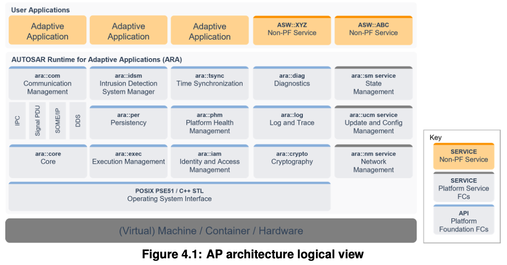
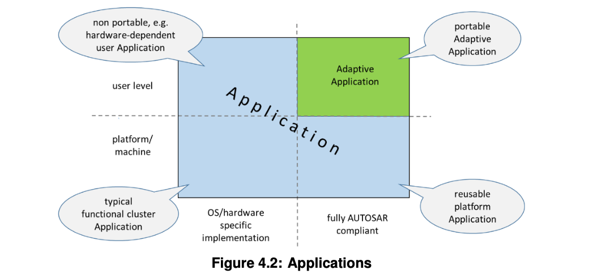
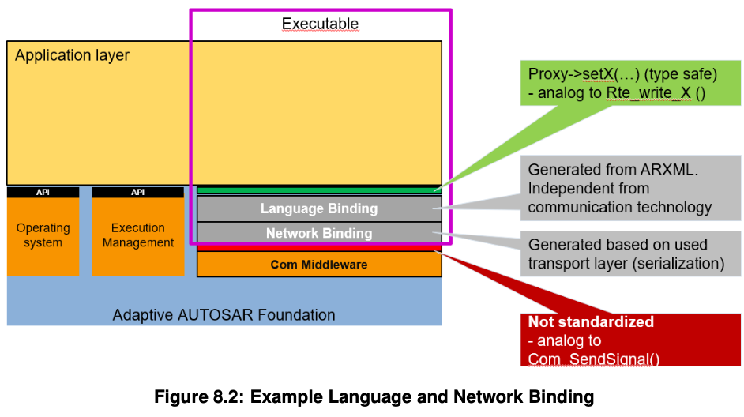

# R21-11 Explanation of Platform Design
## 変更点
* RESTが削除  
* IDSMの紹介が追加  
* SHMの紹介がPHMのチャプターで追加  
* Persistencyの章を修正  
* UCMとSMの関連について修正  
* EM,Diag,TSyncのマイナーアップデート  

## 3 Technical Scope and Approach
### 3.1 Overview - a landscape of intelligent ECUs
従来、ECUは主に、電気機械システムを置き換えたり増強したりする機能を実装しています。これらの深く組み込まれたECUのソフトウェアは、  
車両ネットワークに接続された他のECUからの入力信号と情報に基づいて電気出力信号を制御します。  
制御ソフトウェアの多くは、対象車両用に設計および実装されており、車両の寿命中に大幅に変更されることはありません。
高度に自動化された運転などのいくつかの車両機能は、非常に複雑でコンピューティングリソースを要求するソフトウェアを車両に導入し、厳格な整合性とセキュリティ要件を満たす必要があります。  
このようなソフトウェアは、環境認識や行動計画などの機能を実現し、車両を外部のバックエンドおよびインフラストラクチャシステムに統合します。  
車両のソフトウェアは、外部システムの進化や機能の向上により、車両のライフサイクル中に更新する必要があります。  
  
AUTOSAR Classic Platform（CP）規格は、深く組み込まれたECUのニーズに対応していますが、  
上記のECUのニーズを満たすことはできません。  
したがって、AUTOSARは、2番目のソフトウェアプラットフォームであるAUTOSAR Adaptive Platform（AP）を指定します。  
APは、主に高性能コンピューティングおよび通信メカニズムを提供し、柔軟なソフトウェア構成を提供します。  
無線でのソフトウェアアップデートをサポートします。電気信号や自動車固有のバスシステムへのアクセスなど、  
CP用に特別に定義された機能は、APに統合できますが、標準化の焦点にはなりません。  

> 自動運転などの複雑なソフトウェアを導入するためにリソースへの要求は高まり、外部との通信(OTAなど)  
> によってソフトウェアの更新をかける必要も出てきた。  
> 上記の文に書いてあるように、CPでは対応できない、高性能コンピューティングおよび通信メカニズムを提供し、  
> 柔軟なソフトウェア構成を提供するといった点がAPの役割。

### 3.2 Technology Drivers
背後にあるテクノロジードライバーの2つの主要なグループがあります。  
1つはイーサネットで、もう1つはプロセッサです。  

車載ネットワークのますます増大する帯域幅要件により、イーサネットが導入されました。  
イーサネットは、より高い帯域幅を提供し、ネットワークを切り替えて、長いメッセージのより効率的な転送、  
ポイントツーポイント通信などを可能にします。  
CANなどの従来の車載通信技術と比較して。 CPはイーサネットをサポートしていますが、  
主にレガシー通信テクノロジー向けに設計されており、そのために最適化されており、  
イーサネットベースの通信機能を十分に活用してメリットを得るのは困難です。  

> EthernetとはTCP/IPに対応した有線の規格のこと。
> LANケーブルはEthernet規格のケーブル。従来の車両通信で用いられていたプロトコルはCANやLINなど。
> CANやLINだと大容量データなどの通信には不向きな印象。
> 通信速度は10Mbps。
> CANは一回に送信できるデータは8バイト。通信速度は最大1Mbps。
> 以下サイトをみるとEthernetとは、なぜ車載に必要なのかがまとめられている。
> https://monoist.itmedia.co.jp/mn/articles/1905/13/news008.html

同様に、車両がさらにインテリジェントになるにつれて、  
プロセッサのパフォーマンス要件は近年非常に大きくなっています。  
マルチコアプロセッサはすでにCPで使用されていますが、処理能力のニーズにはマルチコア以上のものが必要です。  
数十から数百のコアを備えたメニーコアプロセッサ、GPGPU（GPUの汎用使用）、FPGA、および専用アクセラレータが登場しています。  
これらは、従来のMCUよりも桁違いに高いパフォーマンスを提供するためです。

> メニーコアはめちゃくちゃいっぱいプロセッサがあるCPUっていう大雑把な理解でOK
> https://wa3.i-3-i.info/word18085.html

コア数の増加は、マルチコアをサポートできますが、元々シングルコアMCU用に設計されたCPの設計を圧倒します。 
また、コンピューティング能力が高まるにつれ、データセンターでも電力効率がすでに問題になっています。  
実際、これらのインテリジェントECUにとってははるかに重要です。  
半導体およびプロセッサテクノロジの観点からは、ポラックの法則に制約されるため、  
プロセッサの周波数を際限なく上げることは物理的に不可能であり、パフォーマンスを拡張する唯一の方法は、  
複数（および多数）のコアを使用して並列に実行することです。  
また、ワットあたりの最高のパフォーマンスは、メニーコア、コプロセッサー、GPU、FPGA、  
アクセラレーターなどのさまざまなコンピューティングリソースを組み合わせることで達成されることが知られています。  
これはヘテロジニアスコンピューティングと呼ばれ、現在HPC（ハイパフォーマンスコンピューティング）で活用されていますが、  
CPの範囲をはるかに圧倒しています。

また、プロセッサとより高速な通信の両方の複合効果があることにも言及する価値があります。  
メニーコアプロセッサのように、より多くの処理要素が1つのチップに統合されるにつれて、  
これらの処理要素間の通信は、従来のECU間通信よりも桁違いに高速かつ効率的になります。  
これは、Network-on-Chip（NoC）などの新しいタイプのプロセッサ相互接続テクノロジによって可能になりました。  
より多くの処理能力とチップ内のより高速な通信のこのような複合効果はまた、  
増え続けるシステム要件を拡張できる新しいプラットフォームの必要性を促します。

### 3.3 Adaptive Platform - Characteristics
APの特性は、セクション3.1および3.2で概説されている要因によって形成されます。ランドスケープは必然的にかなり多くのコンピューティングパワーを必要とし、テクノロジーのトレンドはそのようなニーズを満たすためのベースラインを提供します。ただし、安全関連領域のHPCは、電力とコストの効率も重要ですが、それ自体がさまざまな新しい技術的課題を課しています。  

それらに取り組むために、APは、従来はECUによって十分に活用されていなかったさまざまな実証済みのテクノロジーを採用し、APの実装において革新的なテクノロジーを活用するための最大限の自由を可能にします。  

#### 3.3.1 C++
トップダウンから、アプリケーションはC ++でプログラムできます。これは現在、ソフトウェア業界や学者のパフォーマンスが重要で複雑なアプリケーションでの新しいアルゴリズムやアプリケーションソフトウェアの開発に最適な言語です。これにより、新しいアルゴリズムのより迅速な適応がもたらされ、適切に使用された場合、アプリケーション開発の生産性が向上するはずです。

#### 3.3.2 SOA  
複雑なアプリケーションをサポートすると同時に、分散とコンピューティングリソースの割り当てを処理する際に最大限の柔軟性とスケーラビリティを実現するために、APはサービス指向アーキテクチャ（SOA）に従います。  
SOAは、システムが一連のサービスで構成され、その中で1つが別のサービスを順番に使用し、アプリケーションがそのニーズに応じて1つ以上のサービスを使用するという概念に基づいています。  
多くの場合、SOAは、APにもあるシステムごとの特性を示します。  
たとえば、サービスは、アプリケーションも実行しているローカルECUに存在する場合もあれば、APの別のインスタンスも実行しているリモートECUに存在する場合もあります。  
アプリケーションコードはどちらの場合も同じです。  
通信インフラストラクチャが違いを処理し、透過的な通信を提供します。  
このアーキテクチャを見る別の方法は、分散コンピューティングの方法であり、何らかの形式のメッセージパッシングを介して通信します。  
概して、これらはすべて同じ概念を表しています。このメッセージパッシングの通信ベースのアーキテクチャは、イーサネットなどの高速で高帯域幅の通信の台頭からも恩恵を受けることができます。  

> Serviceによって、異なるECUにも機能を提供できる。  

## 4 Architecture
### 4.1 Logical view
#### 4.1.1 ARA
図4.1に、APのアーキテクチャを示します。  
アダプティブアプリケーション（AA）は、アダプティブアプリケーション用のAUTOSARランタイムであるARA上で実行されます。 ARAは、Adaptive PlatformFoundationまたはAdaptivePlatformServicesのいずれかに属するFunctionalClustersによって提供されるアプリケーションインターフェイスで構成されています。 Adaptive Platform FoundationはAPの基本的な機能を提供し、Adaptive PlatformServicesはAPのプラットフォーム標準サービスを提供します。図に非プラットフォームサービスとして示されているように、どのAAも他のAAにサービスを提供できます。

> Adaptive Platform FoundationはAPIで直接AAに機能を提供する。Adaptive Platform ServiceはAPIという形ではなく、サービスとしてAAに機能を提供する。

Functional Clusterのインターフェースは、Adaptive PlatformFoundationまたはAdaptivePlatform Servicesのいずれかであり、AAの観点からは無関心です。これらは、指定されたC ++インターフェース、またはAPが将来サポートする可能性のあるその他の言語バインディングを提供するだけです。確かに内部には違いがあります。また、AAコンテキストで呼び出されるARAのライブラリを含むARAインターフェイスの下では、ARA以外のインターフェイスを使用してAPの仕様を実装する場合があり、AP実装の設計次第であることに注意してください。

図4.1には、APの現在のリリースの一部ではないFunctional Clusterが含まれていることに注意してください。これにより、全体的な構造をより正確に把握できます。ここに示されていないさらに新しいFunctional Clusterは、APの将来のリリースに追加される可能性があります。

> idsmが追加されて、RESTが消えた。  

#### 4.1.2 Language binding,C++ Standard Library,and POSIX API
これらのAPIの言語バインディングはC ++に基づいており、C ++標準ライブラリもARAの一部として利用できます。 OS APIに関しては、PSE51インターフェース、POSIX標準の単一プロセスプロファイルのみがARAの一部として利用可能です。 PSE51は、既存のPOSIXアプリケーションに移植性を提供し、アプリケーション間の干渉の自由を実現するために選択されました。  

C ++標準ライブラリには、マルチスレッドAPIを含む、POSIXに基づく多くのインターフェイスが含まれていることに注意してください。複雑さを避けるために、C ++標準ライブラリのスレッドインターフェイスとネイティブのPSE51スレッドインターフェイスを混在させないことをお勧めします。残念ながら、C ++標準ライブラリは、スレッドスケジューリングポリシーの設定など、すべてのPSE51機能を網羅しているわけではありません。このような場合、両方のインターフェースを組み合わせて使用​​する必要があります。  

> ここで言っている言語バインディングはCMの機能の言語バインディングとは異なると思う。  
> ここで言っているのは、C++の標準ライブラリとPSE51 interfaceがARAの一部として利用可能であるということ。具体的な例を挙げると、Coreでデータタイプをラッピングしているとかかな。EMが内部でOSのフォーク処理などを実行しているとかそういういことかもしれない。  
> 言語バインディングの一般的な用語説明としては以下が参考になる。  
> http://www.kotoba.ne.jp/word/言語バインディング  
> 最初の一行はC++用にAPIの言語バインディングが組まれているのでAPI呼び出しはC++のソースコードでよろしくね。っていう意味かな。  
> CMの方の言語バインディングはサービスの表現方法についての機能だと認識している。
> ARXMLで定義したサービスをジェネレートする際にC++でジェネレートするのか、Pythonでジェネレートするのかとかとか。。。  

#### 4.1.3 Application launch and shutdown
アプリケーションのライフサイクルは、Execution Management（EM）によって管理されます。アプリケーションのロード/起動はEMの機能を使用して管理され、アプリケーションを起動するには、システム統合時または実行時に適切な構成が必要です。実際、すべてのFunctional ClusterはEMの観点からはアプリケーションであり、EM自体を除いて、同じ方法で起動されます。図4.2は、AP内およびAP上のさまざまなタイプのアプリケーションを示しています。  

アプリケーションを開始または終了する時期と決定は、EMによって行われないことに注意してください。State Management（SM）と呼ばれる特別なFCはコントローラーであり、システムの設計に基づいてEMをコマンドし、さまざまな状態を調停して、システム全体の動作を制御します。ここでのシステムはマシンAP全体を指し、そのアプリケーションは実行されているため、内部動作、つまり実装はプロジェクト固有です。SMは他のFCとも相互作用して、マシン全体の動作を調整します。SMは、さまざまなAPスタック実装間の移植性を維持するために、標準のARAインターフェイスのみを使用する必要があります。

#### 4.1.4 Application interactions
AA間の相互作用に関しては、PSE51にはIPC（Inter-Process-Communication）が含まれていないため、AA間で相互作用するための直接的なインターフェイスはありません。Communication Management（CM）は、唯一の明示的なインターフェースです。 CMは、アプリケーションに対して透過的な、マシン内とマシン間の両方のサービス指向通信も提供します。 CMは、サービスおよびクライアントアプリケーションのトポロジ展開に関係なく、サービス要求/応答のルーティングを処理します。他のARAインターフェースは、AA間の相互作用を内部的にトリガーする可能性があることに注意してください。ただし、これは明示的な通信インターフェースではなく、それぞれのARAインターフェースによって提供される機能の副産物にすぎません。  

> CMはプロセス間、マシン内外の通信機能を担う。  

#### 4.1.5 Non-standard interfaces
AAおよびFunctionalClustersは、標準のAP機能と競合せず、プロジェクトの安全性/セキュリティ要件に準拠している限り、非標準のインターフェイスを使用できます。それらが純粋なアプリケーションローカルランタイムライブラリでない限り、他のAP実装へのソフトウェアの移植性に影響を与えるため、そのような使用を最小限に抑えるように注意する必要があります。  

## 8 Communication Management
### 8.1 Overview
CMは、分散リアルタイム組み込み環境でのアプリケーション間の通信のすべての側面を担当します。  
背後にある概念は、アプリケーションソフトウェアの実装者がアプリケーションの特定の目的に集中できるように、実際のメカニズムから抽象化して通信パートナーを見つけて接続することです。  

### 8.2 Service Oriented Communication
サービスの概念は、基本的なオペレーティングソフトウェアによってすでに提供されている機能を超えてアプリケーションに提供される機能を意味します。  
CMソフトウェアは、マシン内通信およびマシン間通信のためにそのようなサービスを提供または利用するためのメカニズムを提供します。
サービスは以下の組み合わせで構成される。  
* Events  
* Methods  
* Fields 
通信パートナー間の通信パスは、設計時、起動時、または実行時に確立できます。  
このメカニズムの重要なコンポーネントは、ブローカリングインスタンスとして機能し、CommunicationManagementソフトウェアの一部でもあるサービスレジストリです。  

サービスを提供する各アプリケーションは、サービスレジストリでこれらのサービスを登録します。  
アプリケーションがサービスを使用するには、サービスレジストリにクエリを実行して、要求されたサービスを見つける必要があります。このプロセスは、Service Discoveryと呼ばれます。  

> サービス志向通信を実現するために機構を提供してくれている。

### 8.3 Language binding and Network binding
Communication Managementは、定義されたサービスがアプリケーション実装者にどのように提示されるか（上位層、言語バインディング）、およびネットワーク上のサービスのデータのそれぞれの表現（下位層、ネットワークバインディング）を標準化した手段で提供します。
これにより、プラットフォームのさまざまな実装間でのソースコードの移植性とコンパイル済みサービスの互換性が保証されます。  

言語バインディングは、対象のプログラミング言語の便利な機能を使用して、サービスのメソッド、イベント、およびフィールドを直接アクセス可能な識別子に変換する方法を定義します。  
パフォーマンスと型の安全性（ターゲット言語でサポートされている限り）が主な目標です。  
したがって、言語バインディングは通常、サービスインターフェイス定義によって供給されるソースコードジェネレーターによって実装されます。  

> 言語バインディングの機能はコンフィグの時点で設定できるってこと？  
> ソースコードジェネレーターとはara-genや、AUBIST configuratorなどのコード生成ツールのことをおそらく指している。arxmlで設定された内容は、jsonファイルや、cpp,hppなどの実装として吐き出される。各サービス内容はcppファイルで自動生成されるはず。

ネットワークバインディングは、構成されたサービスの実際のデータをシリアル化して特定のネットワークにバインドする方法を定義します。  
生成されたサービス固有のレシピを解釈するか、シリアル化コード自体を直接生成することにより、Communication Management構成（AUTOSARメタモデルのインターフェイス定義）に基づいて実装できます。  
現在、Communication Managementは、SOME / IP、DDS、IPC（プロセス間通信またはその他のカスタムバインディング）、Signal PDU（信号ベースのネットワークバインディング）、および信号ベースの静的ネットワークバインディングをサポートしています。  
ローカルサービスレジストリもネットワークバインディングの一部です。  

注意：LanguageBindingとNetworkBindingの間のインターフェースは、CommunicationManagementソフトウェア内のプライベートインターフェースと見なされます。  
したがって、このインターフェースを定義する規範的な仕様は現在範囲外です。  
それでも、プラットフォームベンダーは、プラットフォーム実装内の他のネットワークバインディングと一緒にC ++以外の言語バインディングを簡単に実装できるように、ソフトウェア用にこのようなインターフェイスを個別に定義することをお勧めします。  

> Language bindingとNetwork bindingよう分からん。
> 後でSWS読んでおく。
> 多分Service IFジェネレートするときにcppとかpythonでジェネレート時に選択できるってのと、使用するプロトコルを選択できるって感じなのかなぁ(SOME/IP,DDSなど)

> CMの機能としては、以下
> * SOA通信メカニズム提供
> * Network binding
> * Language binding
> * Raw Data Streaming Interface

### 8.4 Generated Proxies and Skeletons of C++ Language Binding
C ++言語バインディングの上位層インターフェースは、AUTOSARメタモデルのインターフェース記述で定義されたサービスのオブジェクト指向マッピングを提供します。  

Communication Managementソフトウェアの開発ツールの一部であるジェネレーターは、それぞれのサービスのフィールド、イベント、およびメソッドのタイプセーフな表現を含むC ++クラスを生成します。  

サービス実装側では、これらの生成されたクラスはサービスプロバイダースケルトンと呼ばれます。  
クライアント側では、これらはサービスリクエスタープロキシと呼ばれます。  

> サービス利用側に生成されたクラスー＞プロキシ  
> 提供側はスケルトン

サービスメソッドの場合、サービスリクエスタープロキシは、同期（サーバーが結果を返すまで呼び出し元をブロックする）および非同期呼び出し（呼び出された関数がすぐに戻る）のメカニズムを提供します。 

> 同期通信は、レスポンスが来るまで処理を止める。非同期はリクエストだけ出して処理を継続する。

呼び出し元は他のアクティビティを並行して開始でき、サーバーの戻り値がコアタイプara :: core :: Futureの特別な機能を介して利用可能になったときに結果を受け取ります（セクション18.1.4を参照）。  

プラットフォームの実装は、それぞれのサーバーがまだ利用できない場合に、ジェネレーターがクライアント機能の開発を容易にするためのモックアップクラスを作成するように構成できます。  
同じメカニズムをクライアントの単体テストにも使用できます。  

プロキシクラスはクライアントが直接使用できますが、C ++バインディングのサービスプロバイダースケルトンは単なる抽象基本クラスです。  
サービスの実装は、生成された基本クラスから派生し、それぞれの機能を実装する必要があります。  

> ジェネレートされるのはあくまで抽象クラスなので、スケルトン側の実装は開発者がしなければならない。多分、offerServiceとかの実装のこと指してるのかな…。  

ara :: comのインターフェースは、安全関連のE2E保護通信用のプロキシとスケルトンも提供できます。  
これらのインターフェイスは、E2E保護がオンまたはオフに切り替えられているかどうかに関係なく、アプリケーションとの互換性が保証されるように設計されています。  

### 8.5 Static and dynamic configuration
通信パスの構成は、設計時、起動時、または実行時に発生する可能性があるため、静的または動的のいずれかと見なされます。  
* Full static configuration
  * サーバーはすべてのクライアントを認識し、クライアントはサーバーを認識しているため、サービス検出はまったく必要ありません。
* No discovery by application code
  * クライアントはサーバーを知っていますが、サーバーはクライアントを知りません。イベントサブスクリプションは、アプリケーションの唯一の動的通信パターンです。
* Full service discovery in the application
  * 構成時に通信パスは不明です。サービス検出用のAPIを使用すると、アプリケーションコードは実行時にサービスインスタンスを選択できます。

### 8.6 Service Contract Versioning
SOA環境では、サービスのクライアントとプロバイダーは、サービスのインターフェースと動作をカバーするコントラクトに依存しています。  
サービスの開発中に、サービスインターフェイスまたは動作が時間の経過とともに変化する場合があります。そのため、サービスの異なるバージョンを区別するために、サービス契約のバージョン管理が導入されました。 AUTOSAR Adaptiveプラットフォームは、サービスの設計および展開フェーズのコントラクトバージョニングをサポートします。さらに、クライアントのサービスディスカバリは、バージョンの後方互換性をサポートするように構成できます。これは、提供されているさまざまなサービスバージョンが、クライアントの必要なサービスバージョンと下位互換性がある場合、それらに接続できることを意味します。

### 8.7 Raw Data Streaming interface
サービス指向通信に加えて、CMは、外部ECUに向けて生のバイナリデータストリームを処理するためのスタンドアロンAPIも提供します。 例えば、ADASシステムのセンサー。 APIは静的であり、クライアントアプリケーションがサーバーへの通信チャネルを確立し、サーバーアプリケーションがクライアントからの着信接続を待機する機能を実装します。 APIは、クライアントとサーバーの両方に機能を提供し、通信チャネルを破棄し、通信チャネルを介して生データ（バイトのストリーム）を読み書きします。 Raw Data Streamチャネルは、インテグレーターが展開情報を適用することで構成できます。ネットワークエンドポイント情報と選択されたプロトコル。現在、TCP / IPソケットはトランスポート層として使用されますが、将来的には他の代替手段が追加される可能性があります。 Raw Data Streamインターフェースは、名前空間ara :: com :: rawで使用できます。

### 18.1.4 Future and Promise
ara :: core :: Resultが同期関数呼び出しの一般化された戻り型として使用されるのと同様に、ara :: core :: Futureは非同期関数呼び出しの一般化された戻り型として使用されます。  

ara :: core :: Futureはstd :: futureに厳密にモデル化されていますが、ara :: core :: Resultと相互運用するように拡張されています。  

ara :: core :: Resultと同様に、ara :: core :: Futureは、値またはエラーのいずれかを含むクラスです。  
このコンテンツは、次の2つの方法で抽出できます。  
1. ara :: core :: Future :: getを呼び出すことにより、含まれている値が存在する場合はそれを返し、存在しない場合は例外をスローします。  
2. ara :: core :: Future :: GetResultを呼び出すことにより、Futureからの値またはエラーを含むara :: core :: Resultオブジェクトを返します。  

これらの呼び出しは両方とも、非同期関数呼び出しによって値またはエラーが使用可能になるまでブロックされます。