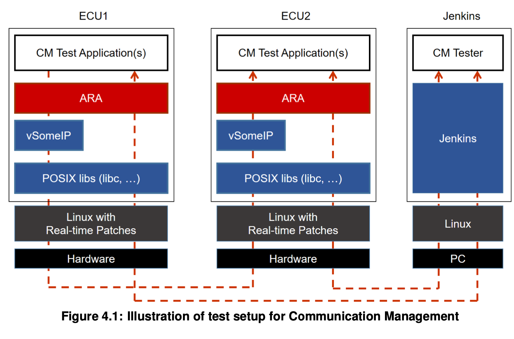
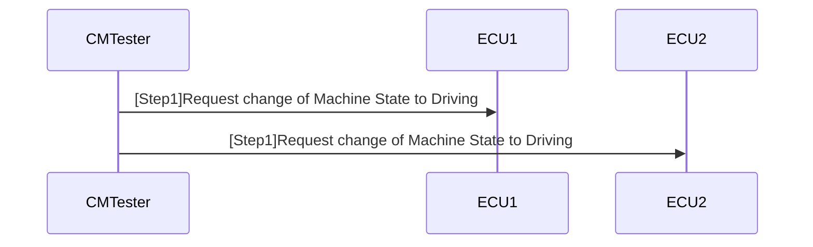
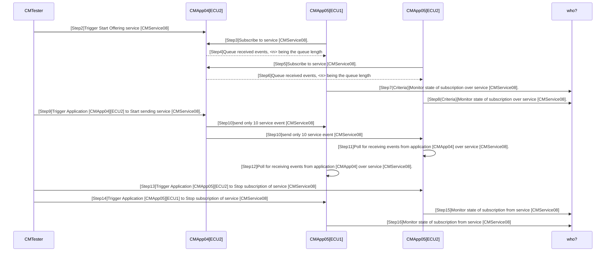

# System Tests of Adaptive Platform
## 4 Test configuration and test steps for Communication Management
### 4.1 Test System
#### 4.1.1 Test configurations Communication Management
|  |  |
| ---- | ---- |
|  ConfigurationID  |  STC_CM_00001  |
|  Description  |  Standard Jenkins server for Communication Management test  |
|  ECU1  |  Hardware, 192.168.100.5  |
|  ECU2  |  Hardware, 192.168.100.2  |
|  Jenkins  |  Jenkins Server, 192.168.100.10  |

|  |  |
| ---- | ---- |
|  ConfigurationID  |  STC_CM_00002  |
|  Description  |   Scenario 2 Variant 2 - Reference Deployment |
|  ECU1  |  Hardware, 192.168.100.5  |
|  ECU2  |  Hardware, 192.168.100.2  |
|  Jenkins  |  Jenkins Server, 192.168.100.10  |

Communication Managementテスト（[CMテスター]）でジョブを実行しているJenkinsサーバーは、イーサネット経由で、システムテストアプリケーション[CMApp01]（および代替構成の[CMApp04]）をホストする[ECU1]と、[ECU2]に接続されます。ECU2はシステムテストアプリケーション[CMApp02]、[CMApp03]、[CMApp04]、および[CMApp05]をホストします。  
[CMテスター]が結果を収集することになっています。  
[CMテスター]とECU上のアプリケーション間の通信は、診断メッセージの形式でDiagnostics functional clusterを介して行われる場合があります。  

#### 4.2.3 [STS_CM_00003] Communication for Events based on polling-based style.
|  |  |
| ---- | ---- |
|  Test Objective  |  アプリケーションがサービスの提供、サブスクライブ、受信、およびサブスクライブの停止を実行できること、および通信がイベントの1対nの通信トポロジで機能することを確認します。アプリケーションは、イベントを受信し、ポーリングベースのスタイルでそれらにアクセスできます。  |
|  ID  |   STS_CM_00003 |
|  State  |  Draft  |
|  Affeted Functional Cluster  |  Communication Management  |
|  Trace to RS Criteria  |  [RS_CM_00101], [RS_CM_00102], [RS_CM_00104], [RS_CM_00105], [RS_CM_00106], [RS_CM_00201], [RS_CM_00202], [RS_CM_00206]  |
|  Reference to Test Environment  |  STC_CM_00002    |
|  Configuration Parameters  |  - 既存の通信サービスは次のもので構成されます（サービス名は任意です）。  - [CMService08]: Offered by [CMApp04], requested by [CMApp05].  - Service [CMService08] is an attribute of Events.  - Reception of services from Server to Proxy is possible using pooling-based style.  |
|  Summary  |  最初に[CMテスター]が[ECU1]と[ECU2]のアプリケーションにMachine StateをDrivingに遷移する要求を出します。 [CMテスター] [ECU1]と[ECU2]で拡張診断セッションを要求します。 [CMテスター]はアプリケーション[CMApp04] [ECU2]のサービス[CMService08]の提供をトリガーし、次にアプリケーション[CMApp04] [ECU2]または[ECU1]がサービス[CMService08]の提供を開始します。  [CMService08]は[ECU1]の[CMApp05]にSubscribeされます。 アプリケーション[CMApp05] [ECU1]キューはイベントを受信しました。<n>はキューの長さです。 サービス[CMService08]は、[ECU2]上のアプリケーション[CMApp05]インスタンスによってサブスクライブされます。 アプリケーション[CMApp05] [ECU2]キューはイベントを受信しました。<n>はキューの長さです。 アプリケーション[CMApp05] [ECU1]は、サービス[CMService08]の[CMApp04]によって提供されるサブスクリプションの状態を監視します。 アプリケーション[CMApp05] [ECU2]は、サービス[CMService08]の[CMApp04]によって提供されるサブスクリプションの状態を監視します。 [CM Tester]は、アプリケーション[CMApp04] [ECU1]をトリガーして、サービス[CMService08]の送信を開始します。 アプリケーション[CMApp04] [ECU2]は、サービス[CMService08]を介してサービスイベントを送信します。 アプリケーション[CMApp05] [ECU2]は、サービス[CMService08]を介してアプリケーション[CMApp04]からイベントを受信するためにポーリングします。 アプリケーション[CMApp05] [ECU1]は、サービス[CMService08]を介してアプリケーション[CMApp04]からイベントを受信するためにポーリングします。 [CMテスター]アプリケーション[CMApp05] [ECU2]とアプリケーション[CMApp05] [ECU1]をトリガーして、サービス[CMService08]のサブスクライブを停止します。 アプリケーション[CMApp05] [ECU2]アプリケーション[CMApp04]のサービス[CMService08]からのサブスクリプションの状態を監視します。 アプリケーション[CMApp05] [ECU1]アプリケーション[CMApp04]のサービス[CMService08]からのサブスクリプションの状態を監視します。 サービス検出が成功すると、1対nの通信トポロジが確立されます。 注：提供の順序については、提供と要求の特定の順序は必要ありません。|
| Pre-conditions | - [CMテスター]は両方のECUに接続されています。  - 両方のECUはMachine State Parkingにあります。  - [ECU2]の[CMApp04]、[CMApp05]、[ECU1]の[CMApp05]は、Machine Stateに応じてシャットダウンされます。 |
| Post-conditions | CMテスターは両方のECUに接続されていません。 |
| Test Steps | Pass Criteria |
| Step1 Request change of Machine State to Driving for [ECU1] and [ECU2]. |  |
| Step2 [CM Tester]Trigger Application [CMApp04][ECU2] to Start Offering service [CMService08]. |  |
| Step3 [CMApp05][ECU1]Subscribe to service [CMService08]. |  |
| Step4 [CMApp05] [ECU1]Queue received events, <n> being the queue length |  |
| Step5 [CMApp05][ECU2]Subscribe to service [CMService08]. |  |
| Step6 [CMApp05] [ECU2]Queue received events, <n> being the queue length |  |
| Step7 [CMApp05][ECU1]Monitor state of subscription over service [CMService08]. | [CMApp05] [ECU1]gets the current status of subscription and notification if it changes from service [CMService08] of application [CMApp04]. |
| Step8 [CMApp05][ECU2]Monitor state of subscription over service [CMService08]. | [CMApp05] [ECU2]gets the current status of subscription and notification if it changes from service [CMService08] of application [CMApp04].|
| Step9 [CM Tester]Trigger Application [CMApp04][ECU2] to Start sending service [CMService08] | |
| Step10 [CMApp04][ECU2]send only 10 service event [CMService08] | |
| Step11 [CMApp05][ECU2]サービス[CMService08]を介してアプリケーション[CMApp04]からイベントを受信するためにポーリングします。| [CMApp05] [ECU2]Event is not received over service [CMService05] of application [CMApp04].|
| Step12 [CMApp05][ECU1]サービス[CMService08]を介してアプリケーション[CMApp04]からイベントを受信するためにポーリングします。| [CMApp05] [ECU1]Event is not received over service [CMService05] of application [CMApp04].|
| Step13 [CM Tester]Trigger Application [CMApp05][ECU2] to Stop subscription of service [CMService08]| |
| Step14 [CM Tester]Trigger Application [CMApp05][ECU1] to Stop subscription of service [CMService08]| |
| Step15 [CMApp05] [ECU2]Monitor state of subscription from service [CMService08] of application [CMApp04].| [CMApp05] [ECU2]gets the current status of subscription, i.e. [CMApp05] [ECU2] has stopped subscription from service [CMService05].|
| Step16 [CMApp05] [ECU1]Monitor state of subscription from service [CMService08] of application [CMApp04].| [CMApp05] [ECU1]gets the current status of subscription, i.e. [CMApp05] [ECU2] has stopped subscription from service [CMService05].|    

> diagnostic sessionって？

> step4よくわからん。Ackのこと？

> passcriteria7,8の具体的実装方法がイメージ湧いていない。サンプルを探しておいた方がいい。

> Step10の10 service eventの部分がよく分からない。イベント通信を10回行うってこと？

> PassCriteria11のService05ってどっから湧いてきた？
    

